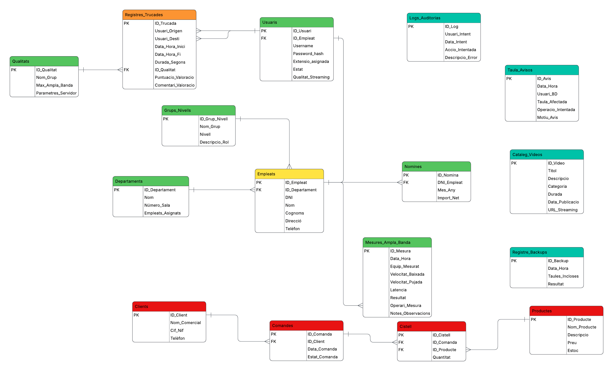

## 👥 Equip de Desenvolupament (pro-asixc1C-g1)
Aquest projecte ha estat desenvolupat i mantingut per:
* **Laia Coca**
* **Emilia Tikohonova**
* **Brenda Castro**
* **Mario Cabeza**

---

## 📖 Descripció del Projecte

Aquest repositori conté tota la infraestructura física, els scripts d'automatització, els *triggers* de seguretat i les polítiques de *hardening* del sistema operatiu dissenyats específicament per a la plataforma de comunicació, suport i streaming de **InnovateTech**.

L'objectiu principal és garantir una gestió de dades eficient, segura i altament disponible, cobrint des de la gestió de personal fins a la monitorització de qualitat de xarxa (QoS).

---

<div align="center">
  <h1>📋 Servidor LOGS: Rsyslog + ELK Stack</h1>
  <p><i>Configuració centralitzada de logs amb Ansible, Rsyslog, Elasticsearch, Kibana i Filebeat per a InnovateTech.</i></p>

  
  
  
  
  
</div>

---

## 📖 Descripció de l'Apartat

Aquest document descriu la configuració completa del servidor de **logs centralitzat** d'InnovateTech (`srv-logs`), desplegat sobre una instància **Amazon EC2** amb Ubuntu. Inclou la creació de l'usuari i accés per clau pública, la instal·lació i automatització amb **Ansible**, la configuració de **Rsyslog** per recollir logs de totes les màquines via UDP/TCP al port 514, i el desplegament de l'**ELK Stack** (Elasticsearch + Kibana + Filebeat) per a la visualització centralitzada dels logs.

---

# LOGS

## 🗺️ Apartat 5: Configuració del Servidor de Logs

### 📋 Paràmetres del Servidor

| Paràmetre | Valor |
| :--- | :--- |
| **Hostname** | `srv-logs` |
| **Usuari creat** | `emilia` |
| **IP del servidor** | `10.0.6.239` |
| **Port Rsyslog** | `514` (UDP + TCP) |
| **Port Kibana** | `5601` |
| **Port Elasticsearch** | `9200` |
| **Versió Ansible** | `2.20.1` |

---

### 👤 5.1. Creació d'Usuari i Configuració d'Accés per Clau Pública

```bash
# Crear el nou usuari
sudo adduser emilia

# Afegir l'usuari al grup sudo
sudo usermod -aG sudo emilia

# Canviar a l'usuari emilia
su emilia

# Crear el directori .ssh i configurar l'accés per clau pública
mkdir -p ~/.ssh
chmod 700 ~/.ssh
touch ~/.ssh/authorized_keys
chmod 600 ~/.ssh/authorized_keys

# Afegir la clau pública al fitxer authorized_keys
sudo nano ~/.ssh/authorized_keys
```

#### Privilegis sudo sense contrasenya per a Ansible

```bash
sudo visudo
```

```
root        ALL=(ALL:ALL) ALL

# Members of the admin group may gain root privileges
%admin      ALL=(ALL) ALL

# Allow members of group sudo to execute any command
%sudo       ALL=(ALL:ALL) ALL

@includedir /etc/sudoers.d

# Emilia pot executar sudo sense contrasenya (necessari per a Ansible)
emilia      ALL=(ALL) NOPASSWD:ALL
```

---

### ⚙️ 5.2. Instal·lació d'Ansible

```bash
# Actualitzar la llista de paquets
sudo apt update

# Instal·lar Ansible
sudo apt install ansible -y

# Verificar la versió instal·lada
ansible --version
# ansible [core 2.20.1]
#   python version = 3.14.4
#   jinja version = 3.1.6
#   pyyaml version = 6.0.3 (with libyaml v0.2.5)
```

#### Crear l'estructura de directoris d'Ansible

```bash
# Crear el directori de treball d'Ansible
mkdir ~/ansible
cd ~/ansible

# Crear el fitxer d'inventari
nano inventory.ini
```

Contingut de `inventory.ini`:

```ini
[logs]
localhost ansible_connection=local
#Ansible se administra a si mismo
```

---

### 📡 5.3. Playbook Rsyslog: Configuració del Servidor de Recepció de Logs

Es crea el playbook `rsyslog.yml` per automatitzar la instal·lació i configuració de Rsyslog com a servidor centralitzat de logs, habilitant la recepció via UDP i TCP al port 514.

```bash
nano ~/ansible/rsyslog.yml
```

Contingut de `rsyslog.yml`:

```yaml
---
- hosts: logs
  become: yes

  tasks:

    - name: Instalar rsyslog
      apt:
        name: rsyslog
        state: present
        update_cache: yes

    - name: Habilitar recepción UDP
      lineinfile:
        path: /etc/rsyslog.conf
        regexp: '^#module\(load="imudp"\)'
        line: 'module(load="imudp")'

    - name: Abrir puerto UDP 514
      lineinfile:
        path: /etc/rsyslog.conf
        regexp: '^#input\(type="imudp" port="514"\)'
        line: 'input(type="imudp" port="514")'

    - name: Habilitar recepción TCP
      lineinfile:
        path: /etc/rsyslog.conf
        regexp: '^#module\(load="imtcp"\)'
        line: 'module(load="imtcp")'

    - name: Abrir puerto TCP 514
      lineinfile:
        path: /etc/rsyslog.conf
        regexp: '^#input\(type="imtcp" port="514"\)'
        line: 'input(type="imtcp" port="514")'
      notify: Reiniciar rsyslog

  handlers:
    - name: Reiniciar rsyslog
      service:
        name: rsyslog
        state: restarted
        enabled: yes
```

#### Execució del playbook (primera vegada — aplica canvis)

```bash
ansible-playbook -i inventory.ini rsyslog.yml -K
# BECOME password:
#
# PLAY [logs] *******************************************************************
# TASK [Gathering Facts] ********************************************************
# TASK [Instalar rsyslog]        ok: [localhost]
# TASK [Habilitar recepción UDP] changed: [localhost]
# TASK [Abrir puerto UDP 514]    changed: [localhost]
# TASK [Habilitar recepción TCP] changed: [localhost]
# TASK [Abrir puerto TCP 514]    changed: [localhost]
# TASK [Reiniciar rsyslog]       changed: [localhost]
#
# PLAY RECAP ********************************************************************
# localhost : ok=7  changed=5  unreachable=0  failed=0  skipped=0  rescued=0
```

#### Execució del playbook (segona vegada — idempotent, sense canvis)

```bash
ansible-playbook -i inventory.ini rsyslog.yml
# PLAY RECAP ************************************************************
# localhost : ok=7  changed=1  unreachable=0  failed=0  skipped=0  rescued=0
```

#### Verificació del port 514 actiu

```bash
sudo ss -tulnp | grep 514
# udp  UNCONN  0.0.0.0:514  0.0.0.0:*  users:(("rsyslogd",pid=3104,fd=5))
# udp  UNCONN  [::]:514     [::]:*     users:(("rsyslogd",pid=3104,fd=6))
# tcp  LISTEN  0.0.0.0:514  0.0.0.0:*  users:(("rsyslogd",pid=3104,fd=7))
# tcp  LISTEN  [::]:514     [::]:*     users:(("rsyslogd",pid=3104,fd=8))
```

---

### 🔗 5.4. Configuració de les Altres Màquines per Enviar Logs

A cada màquina de la infraestructura (p. ex. `srv-ldap`) s'afegeix una línia al fitxer de configuració de Rsyslog per reenviar tots els logs cap al servidor `srv-logs`:

```bash
sudo nano /etc/rsyslog.d/50-default.conf
```

```
# Reenviar tots els logs al servidor centralitzat (TCP)
*.* @@10.0.6.239
```

```bash
# Reiniciar rsyslog per aplicar els canvis
sudo systemctl restart rsyslog
```

> [!TIP]
> **UDP vs TCP en Rsyslog:** S'utilitza `@@` per a TCP (connexió fiable) i `@` per a UDP. En entorns de producció on la pèrdua de logs no és acceptable, sempre s'ha d'usar TCP (`@@`).

---

### 🛡️ 5.5. Regles del Grup de Seguretat AWS (Security Group)

Per permetre la recepció de logs de la resta de màquines de la xarxa interna, cal afegir les regles d'entrada al grup de seguretat de la instància `srv-logs` a la consola d'AWS:

| Regla | Tipus | Protocol | Port | Origen |
| :--- | :--- | :--- | :--- | :--- |
| **Regla 7** | UDP personalitzat | UDP | 514 | `10.0.0.0/16` |
| **Regla 8** | TCP personalitzat | TCP | 514 | `10.0.0.0/16` |

---

### 📂 5.6. Separació de Logs per Hostname (`remote.conf`)

Per organitzar millor els logs i facilitar l'auditoria, es crea un fitxer de configuració específic a Rsyslog que emmagatzema els logs de cada màquina en un fitxer separat:

```bash
# Crear el directori per als logs remots
sudo mkdir /var/log/remote

# Crear el fitxer de configuració de logs remots
sudo nano /etc/rsyslog.d/remote.conf
```

Contingut de `/etc/rsyslog.d/remote.conf`:

```
$template RemoteLogs,"/var/log/remote/%HOSTNAME%.log"
*.* ?RemoteLogs
& stop
```

```bash
# Aplicar permisos i reiniciar el servei
sudo chmod 755 /var/log/remote
sudo chown syslog:adm /var/log/remote
sudo systemctl restart rsyslog
```

#### Verificació dels fitxers de log per màquina

```bash
ls /var/log/remote
# srv-ldap.log  srv-logs.log

# Seguir en temps real els logs de srv-ldap
sudo tail -f /var/log/remote/srv-ldap.log
# 2026-05-26T07:11:23+00:00 srv-ldap emilia: TEST AUDITORIA LDAP
```

#### Prova d'enviament de log des de `srv-ldap`

```bash
# A la màquina srv-ldap:
logger "mensaje de prueba"
```

#### Recepció confirmada a `srv-logs`

```
2026-05-26T06:55:16+00:00 srv-ldap emilia: mensaje de prueba
```

---

### 🔍 5.7. Playbook ELK Stack: Elasticsearch + Kibana + Filebeat

Es crea el playbook `elk.yml` per desplegar automàticament l'ELK Stack complet sobre el servidor de logs, permetent la visualització gràfica dels logs a través de Kibana.

```bash
cat ~/ansible/elk.yml
```

```yaml
---
- name: Configurar Servidor Central de Logs (Rsyslog + ELK Stack)
  hosts: localhost
  become: yes
  tasks:

  # ========================================
  # 1. PREREQUISITS I REPOSITORIS
  # ========================================
    - name: Actualizar la caché de APT e instalar dependencias básicas
      apt:
        name:
          - apt-transport-https
          - gnupg2
          - curl
        state: present
        update_cache: yes

    - name: Eliminar la clave incorrecta anterior si existe
      file:
        path: /usr/share/keyrings/elasticsearch-keyring.gpg
        state: absent

    - name: Descargar y desarmar la clave GPG de Elastic (Formato Binario Correcto)
      shell: |
        curl -fsSL https://artifacts.elastic.co/GPG-KEY-elasticsearch | gpg --dearmor -o /usr/share/keyrings/elasticsearch-keyring.gpg
      args:
        creates: /usr/share/keyrings/elasticsearch-keyring.gpg

    - name: Asegurar permisos correctos en la clave descargada
      file:
        path: /usr/share/keyrings/elasticsearch-keyring.gpg
        mode: '0644'
        owner: root
        group: root

    - name: Añadir el repositorio oficial de Elastic (Usando la nueva clave binaria)
      apt_repository:
        repo: deb [signed-by=/usr/share/keyrings/elasticsearch-keyring.gpg] https://artifacts.elastic.co/packages/7.x/apt stable main
        state: present
        filename: elastic-7.x

  # ========================================
  # 2. CONFIGURACIÓ DE RSYSLOG
  # ========================================
    - name: Asegurar que el directorio de logs remotos existe con permisos correctos
      file:
        path: /var/log/remote
        state: directory
        owner: syslog
        group: adm
        mode: '0755'

    - name: Habilitar el módulo de recepción UDP en Rsyslog
      lineinfile:
        path: /etc/rsyslog.conf
        regexp: '^#module\(load="imudp"\)'
        line: 'module(load="imudp")'
      notify: Reiniciar rsyslog

    - name: Configurar puerto de escucha TCP 514 en Rsyslog
      lineinfile:
        path: /etc/rsyslog.conf
        regexp: '^#input\(type="imtcp" port="514"\)'
        line: 'input(type="imtcp" port="514")'
      notify: Reiniciar rsyslog

    - name: Crear la plantilla de filtrado para separar logs por Hostname
      copy:
        dest: /etc/rsyslog.d/remote.conf
        content: |
          $template RemoteLogs,"/var/log/remote/%HOSTNAME%.log"
          *.* ?RemoteLogs
          & stop
      notify: Reiniciar rsyslog

  # ========================================
  # 3. CONFIGURACIÓ D'ELASTICSEARCH
  # ========================================
    - name: Instalar Elasticsearch
      apt:
        name: elasticsearch
        state: present

    - name: Configurar Elasticsearch para escuchar localmente
      lineinfile:
        path: /etc/elasticsearch/elasticsearch.yml
        regexp: '^#?network.host:'
        line: 'network.host: 127.0.0.1'
      notify: Reiniciar elasticsearch

    - name: Asegurar que Elasticsearch está iniciado y habilitado en el arranque
      service:
        name: elasticsearch
        state: started
        enabled: yes

  # ========================================
  # 4. CONFIGURACIÓ DE KIBANA
  # ========================================
    - name: Instalar Kibana
      apt:
        name: kibana
        state: present

    - name: Configurar Kibana para ser accesible desde la Web externa
      lineinfile:
        path: /etc/kibana/kibana.yml
        regexp: '^#?server.host:'
        line: 'server.host: "0.0.0.0"'
      notify: Reiniciar kibana

    - name: Conectar Kibana con la base de datos de Elasticsearch local
      lineinfile:
        path: /etc/kibana/kibana.yml
        regexp: '^#?elasticsearch.hosts:'
        line: 'elasticsearch.hosts: ["http://localhost:9200"]'
      notify: Reiniciar kibana

    - name: Asegurar que Kibana está iniciado y habilitado en el arranque
      service:
        name: kibana
        state: started
        enabled: yes

  # ========================================
  # 5. CONFIGURACIÓ DE FILEBEAT
  # ========================================
    - name: Instalar Filebeat
      apt:
        name: filebeat
        state: present

    - name: Configurar Filebeat para leer la carpeta /var/log/remote/
      copy:
        dest: /etc/filebeat/filebeat.yml
        content: |
          filebeat.inputs:
          - type: log
            enabled: true
            paths:
              - /var/log/remote/*.log

          output.elasticsearch:
            hosts: ["localhost:9200"]
      notify: Reiniciar filebeat

    - name: Asegurar que Filebeat está iniciado y habilitado en el arranque
      service:
        name: filebeat
        state: started
        enabled: yes

  # ========================================
  # REINICIOS AUTOMÀTICS (Handlers)
  # ========================================
  handlers:
    - name: Reiniciar rsyslog
      service:
        name: rsyslog
        state: restarted

    - name: Reiniciar elasticsearch
      service:
        name: elasticsearch
        state: restarted

    - name: Reiniciar kibana
      service:
        name: kibana
        state: restarted

    - name: Reiniciar filebeat
      service:
        name: filebeat
        state: restarted
```

#### Execució del playbook ELK

```bash
ansible-playbook -i inventory.ini elk.yml
# PLAY [Configurar Servidor Central de Logs (Rsyslog + ELK Stack)]
#
# TASK [Actualizar la caché de APT e instalar dependencias básicas]  ok
# TASK [Eliminar la clave incorrecta anterior si existe]             changed
# TASK [Descargar y desarmar la clave GPG de Elastic]                changed
# TASK [Asegurar permisos correctos en la clave descargada]          ok
# TASK [Añadir el repositorio oficial de Elastic]                    ok
# TASK [Asegurar que el directorio de logs remotos existe]           ok
# TASK [Habilitar el módulo de recepción UDP en Rsyslog]             ok
# TASK [Configurar puerto de escucha TCP 514 en Rsyslog]             ok
# TASK [Crear la plantilla de filtrado para separar logs]            ok
# TASK [Instalar Elasticsearch]                                      ok
# TASK [Configurar Elasticsearch para escuchar localmente]           ok
# TASK [Asegurar que Elasticsearch está iniciado y habilitado]       ok
# TASK [Instalar Kibana]                                             changed
# TASK [Configurar Kibana para ser accesible desde la Web externa]   changed
# TASK [Conectar Kibana con Elasticsearch local]                     changed
# TASK [Asegurar que Kibana está iniciado y habilitado]              changed
# TASK [Instalar Filebeat]                                           changed
# TASK [Configurar Filebeat para leer /var/log/remote/]              changed
# TASK [Asegurar que Filebeat está iniciado y habilitado]            changed
# RUNNING HANDLER [Reiniciar kibana]                                 changed
# RUNNING HANDLER [Reiniciar filebeat]                               changed
#
# PLAY RECAP *******************************************************************
# localhost : ok=24  changed=11  unreachable=0  failed=0  skipped=0  rescued=0
```

---

### 📊 5.8. Verificació a Kibana

Un cop desplegat l'ELK Stack, s'accedeix a Kibana des del navegador i es crea un **index pattern** per visualitzar els logs recollits per Filebeat:

| Paràmetre | Valor |
| :--- | :--- |
| **URL Kibana** | `http://52.4.133.45:5601` |
| **Index pattern** | `filebeat*` |
| **Timestamp field** | `@timestamp` |
| **Índexos detectats** | `filebeat-7.17.29`, `filebeat-7.17.29-2026.05.28-000001` |
| **Registres indexats** | **26.328 hits** |

> ✅ Kibana detecta correctament els dos índexos de Filebeat i mostra els **26.328 registres** de logs de totes les màquines de la infraestructura en temps real, identificats per `agent.hostname: srv-logs`.

---

> [!TIP]
> **Idempotència d'Ansible:** Gràcies a l'ús dels mòduls `lineinfile`, `copy`, `file` i `service`, els playbooks són **idempotents**: es poden executar múltiples vegades sense causar efectes secundaris. Si una tasca ja està en l'estat desitjat, Ansible la marca com `ok` en lloc de `changed` i no fa cap acció.

---

<div align="center">
  <h1>📁 Màquina WEB: Configuració SFTP + LDAP</h1>
  <p><i>Integració LDAP amb SSSD, configuració del servei SFTP i gestió d'usuaris per a InnovateTech.</i></p>

  
  
  
  
</div>

---

## 📖 Descripció de l'Apartat

Aquest document descriu la configuració del servei **SFTP** sobre la màquina web d'InnovateTech, incloent la integració amb el servidor **LDAP** mitjançant **SSSD** per a l'autenticació centralitzada d'usuaris, la configuració del `sshd_config` per restringir l'accés SFTP i la creació i verificació dels directoris personals dels membres de l'equip.

---

# SFTP + LDAP

## 🗺️ Apartat 1: Configuració SFTP amb Integració LDAP

### 📋 Paquets Instal·lats

| Paquet | Versió | Funció |
| :--- | :--- | :--- |
| `sssd` | 2.12.0-1ubuntu5 | System Security Services Daemon |
| `sssd-ldap` | 2.12.0-1ubuntu5 | Connector LDAP per a SSSD |
| `libpam-sss` | 2.12.0-1ubuntu5 | Mòdul PAM per a SSSD |
| `libnss-sss` | 2.12.0-1ubuntu5 | Biblioteca NSS per a SSSD |
| `ldap-utils` | 2.6.10+dfsg-1ubuntu5 | Eines de línia de comandes LDAP |
| `openssh-server` | 1:10.2p1-2ubuntu3.2 | Servidor SSH/SFTP |

---

### 🔧 1.1. Instal·lació dels Paquets Necessaris

```bash
# Actualitzar la llista de paquets
sudo apt update

# Instal·lar tots els paquets necessaris per a SSSD i LDAP
sudo apt install -y sssd sssd-ldap libpam-sss libnss-sss ldap-utils openssh-server

# Verificar que tots els paquets estan correctament instal·lats
dpkg -l sssd sssd-ldap libpam-sss libnss-sss openssh-server
```

---

### 🗂️ 1.2. Configuració del Fitxer SSSD (`/etc/sssd/sssd.conf`)

El fitxer `sssd.conf` és el nucli de la integració LDAP. Defineix com el sistema resol els usuaris i grups contra el servidor LDAP d'InnovateTech.

```bash
sudo nano /etc/sssd/sssd.conf
```

Contingut del fitxer:

```ini
[sssd]
services = nss, pam
config_file_version = 2
domains = innovatetech.cat

[domain/innovatetech.cat]
id_provider = ldap
auth_provider = ldap

ldap_uri = ldap://10.0.1.224

ldap_search_base = dc=innovatetech,dc=cat

ldap_user_search_base  = ou=users,dc=innovatetech,dc=cat
ldap_group_search_base = ou=groups,dc=innovatetech,dc=cat

ldap_default_bind_dn  = cn=admin,dc=innovatetech,dc=cat
ldap_default_authtok  = Aneto_3404

ldap_schema = rfc2307

ldap_tls_reqcert = never

override_homedir = /home/%u
fallback_homedir = /home/%u
default_shell    = /bin/bash

cache_credentials = true

ldap_id_use_start_tls = false

ldap_user_object_class    = posixAccount
ldap_user_name            = uid
ldap_user_uid_number      = uidNumber
ldap_user_gid_number      = gidNumber
ldap_user_home_directory  = homeDirectory
ldap_user_shell           = loginShell
ldap_user_password        = userPassword

ldap_auth_disable_tls_never_use_in_production = true
ldap_pwd_policy = none
```

Un cop desat el fitxer, s'apliquen els permisos correctes (obligatoris perquè SSSD arrenqui):

```bash
# Permisos estrictes requerits per SSSD
sudo chmod 600 /etc/sssd/sssd.conf
sudo chown root:root /etc/sssd/sssd.conf
```

#### Verificació de la integració NSS i PAM

```bash
# Comprovar que NSS resol usuaris via SSS
grep -E "passwd|group|shadow" /etc/nsswitch.conf
# passwd:   files sss
# group:    files sss
# shadow:   files sss
# gshadow:  files sss
# netgroup: nis sss

# Comprovar que PAM utilitza el mòdul SSS per a l'autenticació
grep -i sss /etc/pam.d/common-auth
# auth  [success=1 default=ignore]  pam_sss.so use_first_pass
```

---

### 🔒 1.3. Configuració del Servidor SSH per a SFTP (`/etc/ssh/sshd_config`)

Es modifica la configuració del dimoni SSH per habilitar l'autenticació per contrasenya (necessària per als usuaris LDAP) i per restringir el grup `sftp-users` a accés exclusiu SFTP dins del seu directori personal (*chroot*).

```bash
sudo nano /etc/ssh/sshd_config
```

Paràmetres clau modificats:

```
# Habilitar autenticació per contrasenya per als usuaris LDAP
PasswordAuthentication yes
KbdInteractiveAuthentication yes
UsePAM yes

# Subsistema SFTP intern (substitueix el binari extern)
Subsystem sftp internal-sftp

# Restricció per al grup sftp-users: accés chroot SFTP exclusiu
Match Group sftp-users
        ChrootDirectory /home/%u
        ForceCommand internal-sftp
        AllowTcpForwarding no
        X11Forwarding no
```

---

### 📂 1.4. Creació dels Directoris Personals i Assignació de Permisos

Per a cada membre de l'equip es crea un directori `files` dins del seu home, s'estableix `root:root` com a propietari del home (requisit del chroot SSH) i l'usuari com a propietari del subdirectori `files`.

```bash
# --- Usuari: brenda ---
sudo mkdir -p /home/brenda/files
sudo chown root:root /home/brenda
sudo chmod 755 /home/brenda
sudo chown brenda:brenda /home/brenda/files
sudo chmod 700 /home/brenda/files

# --- Usuari: emilia ---
sudo mkdir -p /home/emilia/files
sudo chown root:root /home/emilia
sudo chmod 755 /home/emilia
sudo chown emilia:emilia /home/emilia/files
sudo chmod 700 /home/emilia/files

# --- Usuari: laia ---
sudo mkdir -p /home/laia/files
sudo chown root:root /home/laia
sudo chmod 755 /home/laia
sudo chown laia:laia /home/laia/files
sudo chmod 700 /home/laia/files

# --- Usuari: mario ---
sudo mkdir -p /home/mario/files
sudo chown root:root /home/mario
sudo chmod 755 /home/mario
sudo chown mario:mario /home/mario/files
sudo chmod 700 /home/mario/files
```

#### Afegir els usuaris al grup `sftp-users`

```bash
sudo usermod -aG sftp-users brenda
sudo usermod -aG sftp-users emilia
sudo usermod -aG sftp-users laia
sudo usermod -aG sftp-users mario

# Verificar que tots els usuaris pertanyen al grup
getent group sftp-users
# sftp-users:x:1002:brenda,emilia,laia,mario
```

#### Verificació de l'estructura de directoris

```bash
ls -la /home/
# drwxr-xr-x  3 root    root    4096 May 27 22:40 brenda
# drwxr-xr-x  3 root    root    4096 May 28 00:37 emilia
# drwxr-xr-x  3 root    root    4096 May 28 00:37 laia
# drwxr-xr-x  3 root    root    4096 May 28 00:38 mario
# drwxr-x---  3 ubrenda ubrenda 4096 May 28 01:16 ubrenda

ls -la /home/brenda/
# drwx------  2 brenda  brenda  4096 May 28 00:58 files
```

---

### ✅ 1.5. Verificació Final dels Serveis i Usuaris LDAP

#### Estat dels serveis

```bash
# Verificar que SSSD està actiu
sudo systemctl status sssd
# ● sssd.service - System Security Services Daemon
#      Active: active (running) since Thu 2026-05-28 00:56:10 UTC; 27min ago

# Verificar que SSH està actiu
sudo systemctl status sshd
# ● ssh.service - OpenBSD Secure Shell server
#      Active: active (running) since Thu 2026-05-28 00:44:27 UTC; 39min ago
```

#### Verificació de resolució d'usuaris LDAP

```bash
# Comprovar que el sistema resol els usuaris via LDAP
getent passwd emilia
# emilia:*:10002:10002:Emilia:/home/emilia:/bin/bash

getent passwd laia
# laia:*:10003:10003:Laia:/home/laia:/bin/bash

getent passwd brenda
# brenda:*:10001:10001:Brenda:/home/brenda:/bin/bash

getent passwd mario
# mario:*:10004:10004:Mario:/home/mario:/bin/bash
```

#### Verificació de connectivitat LDAP

```bash
# Comprovar l'autenticació contra el servidor LDAP
ldapwhoami -x -H ldap://10.0.1.224 -D "uid=brenda,ou=users,dc=innovatetech,dc=cat" -w Aneto_3404
# dn:uid=brenda,ou=users,dc=innovatetech,dc=cat

# Llistar tots els usuaris del directori LDAP
ldapsearch -x -H ldap://10.0.1.224 \
  -b "ou=users,dc=innovatetech,dc=cat" \
  -D "cn=admin,dc=innovatetech,dc=cat" \
  -w Aneto_3404 \
  "(objectClass=posixAccount)" uid uidNumber
# brenda  → uidNumber: 10001
# emilia  → uidNumber: 10002
# laia    → uidNumber: 10003
# mario   → uidNumber: 10004
# result: 0 Success
```

#### Prova de connexió SFTP

```bash
# Connexió SFTP amb l'usuari brenda
sftp brenda@localhost
# (brenda@localhost) Password:
# Connected to localhost.

sftp> ls
# files

sftp> cd files
sftp> ls
# hostname

sftp> exit

# Connexió SFTP amb l'usuari emilia
sftp emilia@localhost
# (emilia@localhost) Password:
# Connected to localhost.
```

---

> [!TIP]
> **Estructura del Chroot:** El directori arrel del chroot (`/home/%u`) ha de ser propietat de `root:root` i tenir permisos `755`. Si l'usuari fos propietari del seu propi home, el dimoni SSH rebutjaria la connexió amb un error de configuració insegura. El subdirectori `files` és on l'usuari té permisos d'escriptura reals.

---

<div align="center">
  <h1>🔐 Servidor LDAP: OpenLDAP + slapd</h1>
  <p><i>Instal·lació, configuració del directori, gestió d'usuaris i grups, i verificació de logs per a InnovateTech.</i></p>

  
  
  
  
</div>

---

## 📖 Descripció de l'Apartat

Aquest document descriu la configuració completa del servidor **OpenLDAP** (`slapd`) d'InnovateTech, desplegat sobre una instància **Amazon EC2** amb Ubuntu. Inclou l'eliminació d'una instal·lació prèvia defectuosa, la reinstal·lació neta, la creació de l'estructura del directori (`base.ldif`, `groups.ldif`, `users.ldif`), l'encriptació de contrasenyes i la verificació mitjançant logs del sistema.

---

# LDAP

## 🗺️ Apartat 2: Configuració del Servidor OpenLDAP

### 📋 Paràmetres del Servidor LDAP

| Paràmetre | Valor |
| :--- | :--- |
| **Hostname** | `srv-ldap` |
| **Usuari administrador** | `emilia` |
| **IP del servidor LDAP** | `10.0.1.224` |
| **Base DN** | `dc=innovatetech,dc=cat` |
| **Admin DN** | `cn=admin,dc=innovatetech,dc=cat` |
| **Contrasenya admin** | `Aneto_3404` |
| **Domini DNS** | `innovatetech.cat` |
| **Organització** | `Innovate Tech` |

---

### 🗑️ 2.1. Eliminació de la Instal·lació Prèvia

Abans de fer una instal·lació neta, s'eliminen completament tots els fitxers i paquets de la instal·lació anterior defectuosa.

```bash
# Eliminar el directori de dades LDAP
sudo rm -rf /var/lib/ldap

# Eliminar el directori de configuració LDAP
sudo rm -rf /etc/ldap

# Desinstal·lar els paquets slapd i ldap-utils completament
sudo apt-get purge -y slapd ldap-utils

# Eliminar les dependències que ja no són necessàries
sudo apt-get autoremove -y

# Netejar la caché de paquets
sudo apt-get autoclean
```

> [!TIP]
> **Neteja completa:** L'ús de `purge` en comptes de `remove` garanteix que també s'eliminen els fitxers de configuració residuals del paquet, evitant conflictes en la reinstal·lació.

---

### 📦 2.2. Instal·lació d'OpenLDAP

```bash
# Instal·lar slapd (servidor LDAP) i les eines de línia de comandes
sudo apt-get install -y slapd ldap-utils
```

#### Configuració interactiva de `slapd`

Durant la instal·lació, l'assistent de configuració (`dpkg-reconfigure`) demana els paràmetres bàsics del directori. Si cal tornar a configurar-lo posteriorment:

```bash
sudo dpkg-reconfigure slapd
```

Els paràmetres introduïts durant l'assistent són:

| Pregunta | Valor introduït |
| :--- | :--- |
| Omit OpenLDAP server configuration? | **No** |
| DNS domain name | `innovatetech.cat` |
| Organization name | `Innovate Tech` |
| Administrator password | `Aneto_3404` |

---

### 🗂️ 2.3. Creació de l'Estructura del Directori (Fitxers LDIF)

#### `base.ldif` — Unitats Organitzatives

Es creen les dues unitats organitzatives principals del directori: `users` i `groups`.

```bash
cat base.ldif
```

```ldif
dn: ou=users,dc=innovatetech,dc=cat
objectClass: organizationalUnit
ou: users

dn: ou=groups,dc=innovatetech,dc=cat
objectClass: organizationalUnit
ou: groups
```

```bash
# Importar les unitats organitzatives al directori
ldapadd -x -D "cn=admin,dc=innovatetech,dc=cat" -W -f base.ldif
# Enter LDAP Password:
# adding new entry "ou=users,dc=innovatetech,dc=cat"
# adding new entry "ou=groups,dc=innovatetech,dc=cat"
```

---

#### `groups.ldif` — Grups POSIX

```bash
cat groups.ldif
```

```ldif
dn: cn=brenda,ou=groups,dc=innovatetech,dc=cat
objectClass: posixGroup
cn: brenda
gidNumber: 10001

dn: cn=emilia,ou=groups,dc=innovatetech,dc=cat
objectClass: posixGroup
cn: emilia
gidNumber: 10002

dn: cn=laia,ou=groups,dc=innovatetech,dc=cat
objectClass: posixGroup
cn: laia
gidNumber: 10003

dn: cn=mario,ou=groups,dc=innovatetech,dc=cat
objectClass: posixGroup
cn: mario
gidNumber: 10004
```

```bash
# Importar els grups al directori
ldapadd -x -D "cn=admin,dc=innovatetech,dc=cat" -W -f groups.ldif
# Enter LDAP Password:
# adding new entry "cn=brenda,ou=groups,dc=innovatetech,dc=cat"
# adding new entry "cn=emilia,ou=groups,dc=innovatetech,dc=cat"
# adding new entry "cn=laia,ou=groups,dc=innovatetech,dc=cat"
# adding new entry "cn=mario,ou=groups,dc=innovatetech,dc=cat"
```

---

#### 🔑 Encriptació de la Contrasenya

Abans de crear els usuaris, es genera el hash SSHA de la contrasenya compartida (`Aneto_3404`):

```bash
slappasswd
# New password:
# Re-enter new password:
# {SSHA}NBA6g6DGt+Hsh9rRTFODuxQiaR+8YIeU
```

---

#### `users.ldif` — Usuaris POSIX

```bash
cat users.ldif
```

```ldif
dn: uid=brenda,ou=users,dc=innovatetech,dc=cat
objectClass: inetOrgPerson
objectClass: posixAccount
objectClass: shadowAccount
uid: brenda
sn: Brenda
cn: Brenda
uidNumber: 10001
gidNumber: 10001
homeDirectory: /home/brenda
loginShell: /bin/bash
userPassword: {SSHA}NBA6g6DGt+Hsh9rRTFODuxQiaR+8YIeU

dn: uid=emilia,ou=users,dc=innovatetech,dc=cat
objectClass: inetOrgPerson
objectClass: posixAccount
objectClass: shadowAccount
uid: emilia
sn: Emilia
cn: Emilia
uidNumber: 10002
gidNumber: 10002
homeDirectory: /home/emilia
loginShell: /bin/bash
userPassword: {SSHA}NBA6g6DGt+Hsh9rRTFODuxQiaR+8YIeU

dn: uid=laia,ou=users,dc=innovatetech,dc=cat
objectClass: inetOrgPerson
objectClass: posixAccount
objectClass: shadowAccount
uid: laia
sn: Laia
cn: Laia
uidNumber: 10003
gidNumber: 10003
homeDirectory: /home/laia
loginShell: /bin/bash
userPassword: {SSHA}NBA6g6DGt+Hsh9rRTFODuxQiaR+8YIeU

dn: uid=mario,ou=users,dc=innovatetech,dc=cat
objectClass: inetOrgPerson
objectClass: posixAccount
objectClass: shadowAccount
uid: mario
sn: Mario
cn: Mario
uidNumber: 10004
gidNumber: 10004
homeDirectory: /home/mario
loginShell: /bin/bash
userPassword: {SSHA}NBA6g6DGt+Hsh9rRTFODuxQiaR+8YIeU
```

```bash
# Importar els usuaris al directori
ldapadd -x -D "cn=admin,dc=innovatetech,dc=cat" -W -f users.ldif
# Enter LDAP Password:
# adding new entry "uid=brenda,ou=users,dc=innovatetech,dc=cat"
# adding new entry "uid=emilia,ou=users,dc=innovatetech,dc=cat"
# adding new entry "uid=laia,ou=users,dc=innovatetech,dc=cat"
# adding new entry "uid=mario,ou=users,dc=innovatetech,dc=cat"
```

---

### 🛡️ 2.4. Configuració de Privilegis Sudo (`/etc/sudoers`)

Es concedeixen privilegis d'administració complets a l'usuari `emilia` per gestionar el servidor LDAP:

```bash
sudo visudo
```

```
root        ALL=(ALL:ALL) ALL

# Members of the admin group may gain root privileges
%admin      ALL=(ALL) ALL

# Allow members of group sudo to execute any command
%sudo       ALL=(ALL:ALL) ALL

@includedir /etc/sudoers.d
emilia      ALL=(ALL) ALL
```

---

### 📊 2.5. Verificació de Logs i Connectivitat

#### Verificació del port LDAP (514/rsyslog)

```bash
# Comprovar que rsyslog escolta al port 514
sudo ss -tulnp | grep 514
# udp  UNCONN  0.0.0.0:514   0.0.0.0:*  users:(("rsyslogd",pid=755,fd=5))
# tcp  LISTEN  0.0.0.0:514   0.0.0.0:*  users:(("rsyslogd",pid=755,fd=7))

# Validar la configuració de rsyslog
sudo rsyslogd -N1
# rsyslogd: version 8.2512.0, config validation run (level 1), master config /etc/rsyslog.conf
# rsyslogd: End of config validation run. Bye.
```

#### Prova d'enviament de log des del servidor LDAP

```bash
# Enviar un missatge de prova al sistema de logs
logger "TEST_INNOVATE: Comunicacion de logs verificada con exito"
```

#### Verificació de la recepció del log

```bash
# Comprovar que el missatge ha arribat correctament al syslog
sudo tail -n 20 /var/log/syslog | grep TEST_INNOVATE
# 2026-05-27T20:11:37+00:00 srv-ldap emilia: TEST_INNOVATE: Comunicacion de logs verificada con exito
```

---

> [!TIP]
> **Ordre dels LDIF:** És important importar els fitxers en l'ordre correcte: primer `base.ldif` (crea les OU), després `groups.ldif` (crea els grups POSIX) i finalment `users.ldif` (crea els usuaris). Invertir l'ordre provocarà errors de referència perquè les entrades pare no existiran encara al directori.
<div align="center">
  <h1>🌐 Màquina WEB: Servidor Nginx + SFTP</h1>
  <p><i>Configuració inicial, accés per clau pública/privada i desplegament del servei web per a InnovateTech.</i></p>

  
  
  
  
</div>

---

## 📖 Descripció de l'Apartat

Aquest document descriu la configuració completa de la màquina web d'InnovateTech, desplegada sobre una instància **Amazon EC2** amb Ubuntu. Inclou la creació d'usuaris, la configuració d'accés segur mitjançant clau pública/privada RSA i la instal·lació i verificació del servidor web **Nginx**.

---

# MÀQUINA WEB

## 🗺️ Apartat 3: Configuració de la Màquina Web

### 📋 Paràmetres de la Màquina

| Paràmetre | Valor |
| :--- | :--- |
| **Hostname** | `srv-web-ftps` |
| **Usuari creat** | `brenda` |
| **IP pública** | `98.83.3.235` |
| **IP privada** | `10.0.1.112` |
| **Sistema Operatiu** | Ubuntu 26.04 LTS (GNU/Linux 7.0.0-1004-aws x86\_64) |
| **Servei web** | Nginx |

---

### 🔧 3.1. Configuració Inicial

#### Creació d'Usuari i Hostname

El primer pas és crear un nou usuari al sistema i afegir-lo al grup `sudo` per disposar de privilegis d'administrador. A continuació, es canvia el hostname de la màquina per identificar-la correctament dins de la infraestructura.

```bash
# Crear el nou usuari
sudo adduser ubrenda

# Afegir l'usuari al grup sudo
sudo usermod -aG sudo brenda

# Tancar la sessió actual
exit

# Establir el nou hostname de la màquina
sudo hostnamectl set-hostname srv-web-ftps
```

> Després d'executar aquestes comandes, el prompt del sistema reflecteix el nou nom: **`brenda@srv-web-ftps:~$`**

---

### 🔑 3.2. Configuració d'Accés per Clau Pública/Privada

Per incrementar la seguretat, es desactiva l'accés per contrasenya i s'habilita l'autenticació mitjançant parell de claus RSA. D'aquesta manera es bloqueja qualsevol intent d'atac de força bruta.

**Problema inicial:** Amb la clau `.pem` d'AWS no era possible accedir directament amb l'usuari creat:

```
brenda@98.83.3.235: Permission denied (publickey).
```

**Solució:** Generació d'un nou parell de claus RSA des de la màquina local i còpia de la clau pública a la instància.

#### Pas 1 — Generar el parell de claus a la màquina local

```bash
# Generar el parell de claus RSA
ssh-keygen
# Fitxers generats:
# /home/brenda.castro.7e9/.ssh/id_rsa      → clau privada
# /home/brenda.castro.7e9/.ssh/id_rsa.pub  → clau pública

# Verificar els fitxers generats
ls ~/.ssh
# id_rsa  id_rsa.pub  known_hosts  known_hosts.old
```

#### Pas 2 — Copiar la clau pública generada

```bash
cat ~/.ssh/id_rsa.pub
# ssh-rsa AAAAB3NzaC1yc2EAAAADAQABAAAB... brenda.castro.7e9@HA207-12-WLD-006
```

#### Pas 3 — Crear el directori `.ssh` i afegir la clau a la instància

```bash
# Crear el directori .ssh a la instància
mkdir -p ~/.ssh

# Establir permisos correctes al directori
chmod 700 ~/.ssh

# Crear el fitxer authorized_keys
touch ~/.ssh/authorized_keys

# Establir permisos correctes al fitxer
chmod 600 ~/.ssh/authorized_keys

# Editar el fitxer i enganxar la clau pública copiada anteriorment
sudo nano ~/.ssh/authorized_keys
```

#### Pas 4 — Verificar que la clau s'ha afegit correctament

```bash
cat ~/.ssh/authorized_keys
# ssh-rsa AAAAB3NzaC1yc2EAAAADAQABAAAB... brenda.castro.7e9@HA207-12-WLD-006
```

#### Pas 5 — Connectar-se sense contrasenya

```bash
ssh brenda@98.83.3.235
# Welcome to Ubuntu 26.04 LTS (GNU/Linux 7.0.0-1004-aws x86_64)
```

---

> [!TIP]
> **Seguretat SSH:** Un cop configurada l'autenticació per clau pública, és recomanable desactivar explícitament l'autenticació per contrasenya editant `/etc/ssh/sshd_config` i establint `PasswordAuthentication no`, seguida d'un `sudo systemctl restart ssh`.

---

### 🌍 3.3. Configuració del Servei Web (Nginx)

#### Instal·lació d'Nginx

```bash
# 1. Actualitzar la llista de paquets
sudo apt update

# 2. Actualitzar els paquets instal·lats
sudo apt upgrade

# 3. Instal·lar el servidor web Nginx
sudo apt install nginx
```

#### Verificació de l'Estat del Servei

```bash
sudo systemctl status nginx
```

Resultat esperat:

```
● nginx.service - A high performance web server and a reverse proxy server
     Loaded: loaded (/usr/lib/systemd/system/nginx.service; enabled; preset: enabled)
     Active: active (running) since Thu 2026-05-21 07:17:50 UTC; 20s ago
    Main PID: 12671 (nginx)
      Tasks: 2 (limit: 657)
     Memory: 2.3M (peak: 5.1M)
        CPU: 35ms
```

#### Desplegament de Pàgina Web de Prova

Es modifica el fitxer `index.html` per defecte per verificar el funcionament del servidor amb contingut propi:

```bash
sudo nano /var/www/html/index.html
```

Contingut del fitxer:

```html
<!DOCTYPE html>
<html>
<head>
    <title>Prova</title>
</head>
<body>
    <h1>prova projecte blem:))</h1>
    <p>funcionament</p>
</body>
</html>
```

```bash
# Recarregar Nginx per aplicar els canvis
sudo systemctl reload nginx
```

---

> [!TIP]
> **Verificació:** Accedint a `http://98.83.3.235` des del navegador, primer apareix la pàgina de benvinguda **"Welcome to nginx!"** i, després de modificar l'`index.html` i recarregar el servei, es mostra el contingut personalitzat correctament.

<div align="center">
  <h1>📊 Projecte SGBD: Plataforma Avançada InnovateTech</h1>
  <p><i>Infraestructura, bases de dades i automatització per a serveis de comunicació i streaming.</i></p>

  
  
  
</div>

---

## 🗺️ Apartat 4: Disseny del Model Relacional (16 Taules)

L'esquema de la base de dades s'estructura de forma homogènia en **català**, consolidant un total de **16 taules** operatives. Aquestes taules estan dividides lògicament en diversos mòduls funcionals per facilitar-ne el manteniment i l'escalabilitat.

### 🏢 4.1. Gestió de Personal i Recursos Humans
Aquest mòdul centralitza l'estructura organitzativa de l'empresa, les dades dels treballadors i la gestió financera de les nòmines.

| Taula | Clau Primària (PK) | Claus Foranes (FK) | Columnes i Restriccions Addicionals |
| :--- | :--- | :--- | :--- |
| **`departaments`** | `codi_dept` | - | `nom_compleat`, `telefon` |
| **`grups_nivells`** | `id_grup_nivell` | - | `nom_grup`, `descripcio` |
| **`empleats`** | `dni` | `codi_dept`, `id_grup_nivell` | `nom`, `cognoms`, `adreca`, `telefon` |
| **`nomines`** | `id_nomina` | `dni_empleat` | `mes`, `any`, `salari_base`, `deduccions`, `total_net` |

### 💬 4.2. Sistema de Comunicació, Usuaris i QoS
Gestió dels usuaris de la plataforma (tant interns com externs) i registre de la qualitat de les trucades.

| Taula | Clau Primària (PK) | Claus Foranes (FK) | Columnes i Restriccions Addicionals |
| :--- | :--- | :--- | :--- |
| **`usuaris_sistema`** | `id_usuari` | `dni_empleat` *(Buit per a clients)* | `nom_complet`, `email` (UNIQUE), `extensio_trucades` (UNIQUE), `rol` (ENUM: 'client', 'treballador'), `estat` (ENUM: 'actiu', 'bloquejat'), `enllaç_videotrucada` |
| **`qualitats`** | `id_calitat` | - | `nom_perfil` (ENUM: 'alta', 'mitja', 'baixa'), `max_amplada_banda`, `ports_protocols` |
| **`registre_trucades`**| `id_trucada` | `usuari_origen`, `usuari_desti`, `id_calitat_usada` | `data_hora_inici`, `data_hora_fi`, `durada_segons`, `puntuacio_valoracio` (CHECK), `comentari_valoracio` |

### 🎬 4.3. Streaming i Catàleg de Continguts
Administració del repositori de vídeos i recursos multimèdia de la plataforma.

| Taula | Clau Primària (PK) | Claus Foranes (FK) | Columnes i Restriccions Addicionals |
| :--- | :--- | :--- | :--- |
| **`cataleg_videos`** | `id_video` | - | `titol`, `descripcio`, `categoria`, `durada`, `data_publicacio`, `url_streaming` |

### 📡 4.4. Operacions, Xarxa i Amplada de Banda
Monitoratge tècnic del rendiment de la infraestructura per assegurar l'estabilitat del streaming.

| Taula | Clau Primària (PK) | Claus Foranes (FK) | Columnes i Restriccions Addicionals |
| :--- | :--- | :--- | :--- |
| **`mesures_ampla_banda`**| `id_mesura` | `dni_operari` | `data_hora`, `equip_mesurat`, `velocitat_baixada` (DEC), `velocitat_pujada` (DEC), `latencia` (DEC), `resultat` (ENUM: 'acceptable', 'no acceptable'), `observacions` |

### 🛒 4.5. Operacions Comercials i Vendes
Mòdul encarregat de la gestió de clients empresarials, estoc de productes i facturació.

| Taula | Clau Primària (PK) | Claus Foranes (FK) | Columnes i Restriccions Addicionals |
| :--- | :--- | :--- | :--- |
| **`clients`** | `id_client` | - | `nom_empresa`, `cif`, `telefon_contacte` |
| **`productes`** | `id_producte` | - | `nom_producte`, `preu` (DECIMAL), `estoc` |
| **`comandes`** | `id_comanda` | `id_client` | `data_comanda`, `estat_pagament` |
| **`cistell`** | `id_cistell` | `id_client`, `id_producte`| `quantitat` |

### 🛡️ 1.6. Seguretat, Auditories i Respatller (Mòdul 0377)
Garanteix la traçabilitat de les operacions i l'estat de les còpies de seguretat del SGBD.

| Taula | Clau Primària (PK) | Claus Foranes (FK) | Columnes i Restriccions Addicionals |
| :--- | :--- | :--- | :--- |
| **`taula_avisos`** | `id_avis` | - | `usuari_base_dades`, `taula_afectada`, `operacio_intentada`, `data_hora` |
| **`registre_backups`** | `id_backup` | - | `data_hora`, `taules_incloses`, `resultat` |
| **`logs_auditorias`** | `id_log` | - | `usuari_sistema`, `accio_realitzada`, `detalls`, `data_hora` |

---

> [!TIP]
> **Actualització del Diagrama (Draw.io):** S'han eliminat les taules obsoletes de l'esborrany inicial, garantint que el disseny gràfic de relacions es correspongui de manera estricta i fidel amb aquest esquema físic definitiu de 16 entitats.

---

### 🔄 Actualització del Diagrama (Draw.io / Lucidchart)
Per garantir la correspondència exacta amb el model físic final de 16 entitats, s'han dut a terme les següents accions:
* Eliminació exhaustiva de taules obsoletes de l'esborrany inicial.
* Canvi complet de noms de l'esquema a l'idioma **català**.
* Creació de les taules estructurals: `grups_nivells`, `qualitats` i `registre_trucades`.
* Disseny i enllaç de claus estrangeres (FK) crítiques (com la columna `grup_nivell`).

**Diagrama Entitat-Relació (Model Físic):**
<div align="center">
  
</div>

---

### ☁️ Justificació de la Infraestructura (EC2 vs RDS)
S'ha optat per desplegar el SGBD MariaDB directament sobre una instància **Amazon EC2** en comptes d'utilitzar Amazon RDS pels següents motius:
1. **Control Absolut del Sistema:** L'ús d'una instància EC2 ens permet gestionar directament el sistema operatiu (Ubuntu), gestionar de forma nativa fitxers de configuració del motor i utilitzar eines de tasques programades del sistema com `cron`.
2. **Optimització de Costos:** Amazon RDS presenta uns costos de manteniment, emmagatzematge i instància molt elevats que no s'ajusten a la política econòmica de contenció de despeses d'InnovateTech per a aquest entorn.

---

### 📅 Justificació de la Freqüència de Còpies de Seguretat
S'ha programat una tasca síncrona mitjançant el dimoni `cron` de Linux que s'executa de forma automatitzada **cada dia a les 23:00 hores** (`0 23 * * *`). 
* **Motiu:** Es tria aquesta franja horària nocturna perquè coincideix amb el moment de menor activitat laboral i càrrega transaccional de l'empresa. Això garanteix que la sentència de backup no bloquegi les taules crítiques (`empleats`, `clients`, `comandes` i `registre_trucades`) durant l'operativa diària de l'empresa, assegurant un punt de recuperació òptim sense pèrdua de dades rellevants.

---

## ⚙️ Desplegament i Preparació de l'Entorn

Per posar en marxa l'entorn de la base de dades, cal preparar el servidor instal·lant el sistema gestor. Executa el següent bloc de comandes en un entorn basat en Debian/Ubuntu:

```bash
# 1. Actualitzar els repositoris i paquets del sistema
sudo apt update && sudo apt upgrade -y

# 2. Instal·lar el servidor MariaDB
sudo apt install mariadb-server -y

# 3. Comprovar l'estat del servei per verificar la correcta instal·lació
sudo systemctl status mariadb
chmod 600 ~/.ssh/authorized_keys

# A partir d'aquest moment, s'afegeix la clau pública a l'arxiu authorized_keys
