~~# Projecte Transversal ASIXc1 — InnovateTech
 
> Infraestructura CPD híbrida (física + AWS) amb serveis de directori, logs centralitzats, streaming multimèdia i base de dades per a la plataforma **InnovateTech**.
 
**Curs:** 2025/2026 · **Grup:** ASIXc1C · **Grup:** G01
 
---

## Equip de Desenvolupament
 
| Membre | Rol principal                         |
| :--- |:--------------------------------------|
| Mario Cabeza | Base de dades i automatització        |
| Brenda Castro | Màquina web i SFTP (ansible)          |
| Laia Coca | Serveis d'àudio i vídeo, proposta CPD |
| Emilia Tikohonova | Servidor de logs (ansible), LDAP      |


 
---
 
## Índex


1. [Proposta de CPD](#1-proposta-de-cpd-)
   - 1.1 [Regulacions, estàndards i certificacions](#11-regulacions-estàndards-i-certificacions-)
   - 1.2 [Ubicació física](#12-ubicació-física-)
     - 1.2.1 [Situació física de la sala a l'edifici](#121-situació-física-de-la-sala-a-ledifici)
     - 1.2.2 [Sistemes de climatització](#122-sistemes-de-climatització)
     - 1.2.3 [Mesures per dificultar la identificació de la sala](#123-mesures-per-dificultar-la-identificació-de-la-sala)
     - 1.2.4 [Dimensions i distribució de la sala](#124-dimensions-i-distribució-de-la-sala)
     - 1.2.5 [Terra tècnic i sostre tècnic](#125-terra-tècnic-i-sostre-tècnic)
     - 1.2.6 [Planells, dibuixos, diagrames dels elements anteriorment citats](#126-planells-dibuixos-diagrames-dels-elements-anteriorment-citats)
   - 1.3 [Infraestructura IT](#13-infraestructura-it-)
     - 1.3.1 [Servidors](#131-servidors)
     - 1.3.4 [Distribució racks](#132-distribució-racks)
     - 1.3.4 [Planells / diagrames distribució racks](#133-planells--diagrames-distribució-racks)
   - 1.4 [Infraestructura elèctrica \ d'alimentació redundant](#14-infraestructura-elèctrica--dalimentació-redundant)
   - 1.5 [Seguretat Física](#15-seguretat-física)
     - 1.5.1 [Control d’accés](#151-control-daccés)
     - 1.5.2 [Videovigilància](#152-videovigilància)
     - 1.5.3 [Sistemes de prevenció, detecció i d’extinció d’incendis](#153-sistemes-de-prevenció-detecció-i-dextinció-dincendis)
     - 1.5.4 [Diagra de la seguretat física](#154-diagrama-de-la-seguretat-física)
   - 1.6 [Seguretat Lògica](#16-seguretat-lògica)
     - 1.6.1 [Restricció d’accés per autorització](#161-restricció-daccés-per-autorització)
     - 1.6.2 [Firewall](#162-firewall)
     - 1.6.3 [Monitorizació](#163-monitorizació)
     - 1.6.4 [Còpies de seguretat / backups](#164-còpies-de-seguretat--backups)
     - 1.6.5 [RAIDs](#165-raids)
   - 1.7 [Prevenció de riscos laborals](#17-prevenció-de-riscos-laborals)
   - 1.8 [Implementació del CPD al núvol AWS](#18-implementació-del-cpd-al-núvol-aws-)
     - 1.8.1 [Arquitectura AWS](#181-arquitectura-aws)
     - 1.8.2 [Accés mitjançant clau privada / pública](#182-accés-mitjançant-clau-privada-i-pública--creació-usuari-administratiu)
     - 1.8.3 [SRV web / sftp (ansible)](#183-srv-web--sftp-ansible)
     - 1.8.4 [SRV LDAP](#184-srv-ldap)
     - 1.8.5 [SRV Logs](#185-srv-logs)

2. [Implantació dels serveis d'àudio i vídeo](#2-implantació-dels-serveis-dàudio-i-vídeo-)
   - 2.1 [Descripció general](#21-descripció-general-)
   - 2.2 [Servei d'àudio](#22-servei-dàudio-)
   - 2.3 [Servei de vídeo](#23-servei-de-vídeo-)
   - 2.4 [Servei de videoconferència](#24-servei-de-videoconferència-)
   - 2.5 [Comprovacions d'amplada de banda](#25-comprovacions-damplada-de-banda-)
     - 2.5.1 [Rendiment de xarxa](#251-rendiment-de-xarxa)
     - 2.5.2 [Anàlisi de comportament amb el consum dels serveis multimèdia](#252-anàlisi-de-comportament-amb-el-consum-dels-serveis-multimèdia)
     - 2.5.3 [Anàlisi de comportament amb múltiples serveis actius](#253-anàlisi-de-comportament-amb-múltiples-serveis-actius)
     - 2.5.4 [La infraestructura és suficient?](#254-la-infraestructura-és-suficient)
     - 2.5.5 [Proposta de millores](#255-proposta-de-millores)
3. [Disseny i implementació d'una base de dades](#3-disseny-i-implementació-duna-base-de-dades)
   - 3.1 [Definició de rols](#31-definició-de-rols)
   - 3.2 [Script de creació automatitzada d'usuaris](#32-script-de-creació-automatitzada-dusuaris)
   - 3.3 [Triggers per al control d'accés i auditoria](#33-triggers-per-al-control-daccés-i-auditoria)
   - 3.4 [Events Periòdics](#34-events-periòdics)
   - 3.5 [Disseny Entitat-Relació i Model Relacional](#35-disseny-entitat-relació-i-model-relacional-)
     - 3.5.1 [Diagrama E/R](#351-diagrama-er)
     - 3.5.2 [Esquema relacional](#352-esquema-relacional)
     - 3.5.3 [Implementació en el SGBD](#353-implementació-en-el-sgbd)
---
 

# 1. Proposta de CPD [⬆](#índex)

La nostra proposta per al CPD d’Innovate Tech es tracta d’un disseny preparat per a allotjar diferents tipus de serveis de mannera segura tan fisica com logicament, i sostenible. Els punts els quals em tractat de prioritzar alhore de fer el disseny han sigut els seguents:
- Redundància i tolerància a fallades
- Eficiència energètica
- Facilitat de manteniment
- Seguretat física i lògica
- Possibilitat de creixement futur


## 1.1 Regulacions, estàndards i certificacions [⬆](#índex)

Pel disseny de la distribució i seguretat cpd, ens hem basat en les següents regulacions i estàndards, tant d’espanya com d’arreu del món:

- Redundància:
  - Nivells de classificació de fiabilitat de CPD Tier (Uptime Institute)
- Seguretat física (incendis):
  - NFPA 13 → Sistemes de ruixadors 
  -  NFPA 17 → Sistemes d'extinció de productes químics en sec
  - NFPA 220 → Construcció no combustible
- Disseny
  - ANSI/TIA-942
  - DIN EN 50600 

Els Tiers, són un sistema de classificació que defineix la disponibilitat i fiabilitat d’un CPD a Espanya. 

En el nostre cas, el CPD proposat és dissenyat per entrar al segon tier més redundant, el Tier III. 

La raó principal per escollir aquest tier i no el més òptim, és que la diferència amb el Tier III i Tier IV no és tan notòria en comparació amb els costos que suposaria per a l’empresa. A més, considerem que el Tier IV de moment no és adequat per a la nostra instal·lació per la poca quantitat

Encara i així, al ser una empresa dedicada a la provisió de serveis a tercers, tampoc podem permetre temps d’inactivitat. El tier escollit (III), compta amb una disponibilitat de 99.982%, temps d’inactivitat per any de només de 1.6 hores i redundància N+1 mitjancant SAIs, 1 generador en standby y un ATS, permetent realitzar manteniment sense interrompre el servei .


 
## 1.2 Ubicació física [⬆](#índex)
 
### 1.2.1 Situació física de la sala a l'edifici

La sala del CPD està ubicada a la segona planta de l’edifici i complit les següents mesures de seguretat:

- Distanciada de fonts de radiacions electromagnètiques i de radiofreqüència
- Situada per sobre del nivell de possibles inundacions
- Sense instal·lacions de fontaneria a la planta superior
- Sala sense finestres per reduir riscos externs  
- Accés limitat únicament a personal autoritzat

 
### 1.2.2 Sistemes de climatització
El CPD utilitza una arquitectura de passadís fred i passadís calent per millorar l’eficiència energètica i optimitzar la refrigeració dels equips.

Els dos racks principals es col·loquen paral·lelament deixant un passadís central destinat exclusivament a l’expulsió d’aire calent (passadís calent). 

L’aire calent expulsat pels servidors és capturat al passadís central i evacuat mitjançant conductes de ventilació connectats al sistema de climatització.

L’aire fred és distribuït per la part exterior dels racks mitjançant el terra tècnic i impulsat cap a la part frontal dels servidors. Addicionalment, el sostre tècnic permet la circulació i retorn de l’aire cap als sistemes de climatització.

Condicions ambientals:
- Temperatura entre 22 °C i 24 °C
- Humitat relativa entre 40% i 60%

La humitat és controlada mitjançant sensors ambientals i funcions automàtiques de deshumidificació integrades al sistema de climatització.

 
### 1.2.3 Mesures per dificultar la identificació de la sala
Per augmentar la seguretat física del CPD:
- La sala no disposa de senyalització visible
- Accés restringit amb targeta identificativa
- Porta reforçada amb pany electrònic
- Sistema de videovigilància permanent
- Registre d’accessos
 
### 1.2.4 Dimensions i distribució de la sala

La sala ha estat dimensionada per allotjar tant la infraestructura actual com possibles ampliacions futures. 

Característiques generals 
- Alçada: 2,5 m
- Superfície del CPD: 5 x 5,7 m (28,5 m²)
- Superfície total amb sala del generador: 5 x 8 m (40 m²)

Distribució 
- 1 fila amb 2 racks principals
- Espai reservat per a 2 racks addicionals
- Espai suficient per pas i manteniment
- Sala independent per al generador

Elements addicionals
- ATS situat a prop dels racks
- 2 reixetes de ventilació per la sala del generador

Coses en tenir en compte:
- Separació física entre cablejat de dades i alimentació
- Etiquetatge de tots els cables
- Ús de patch panels
- Canalitzacions específiques per xarxa i energia
- Organització vertical i horitzontal del cablejat


 
### 1.2.5 Terra tècnic i sostre tècnic

El CPD disposarà de terra tècnic elevat per permetre la distribució de l’aire refrigerat, el pas del cablejat elèctric i de xarxa.

El sostre tècnic permet la instal·lació de sensors ambientals, il·luminació, canalitzacions auxiliars i conductes d’extracció d’aire calent. 

 
### 1.2.6 Planells, dibuixos, diagrames dels elements anteriorment citats

Plànol de distribució del CPD:

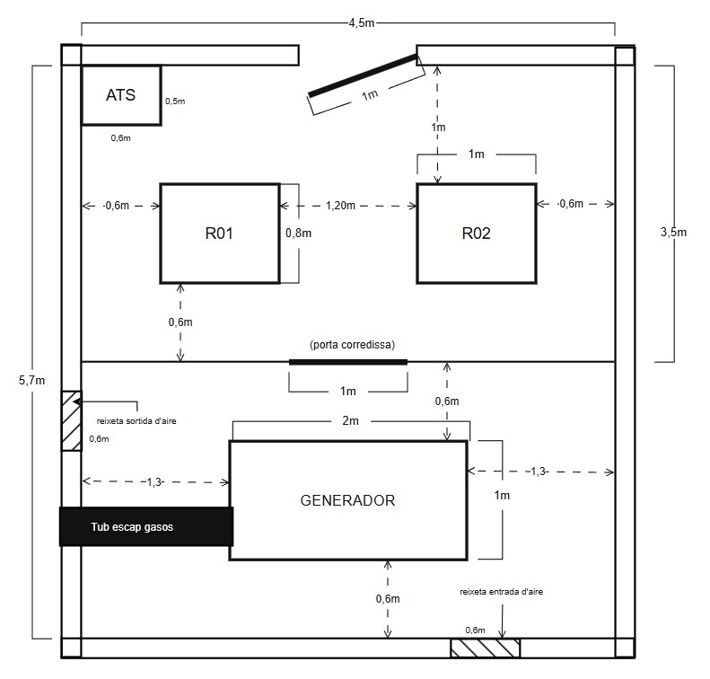

Diagrama del flux elèctric:

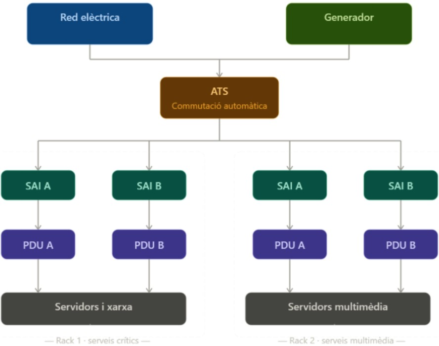


 
## 1.3 Infraestructura IT [⬆](#índex)
Abans de decidir la mida i distribució del cpd, s’ha de numerar la quantitat de servidors, switches i patch panels que Innovate Tech necessita, per estructurar correctament els racks  i després ja poder decidir la col·locació d’aquests a la sala i estimar l’espai que ocuparan a aquesta.
 
A més dels servidors, el cpd també compta amb altres dispositius clau:
- Firewall x1
- Router x1
- Switch x4
- SAI x4
- PDU  x4
- ATS x1
- Generador x1


### 1.3.1 Servidors
Per a la infraestructura de servidors s’han seleccionat servidors rack 2U tipus Dell PowerEdge R740, adequats per entorns virtualitzats i serveis empresarials gràcies a la seva redundància d’alimentació, capacitat d’expansió i compatibilitat amb entorns d’alta disponibilitat. 

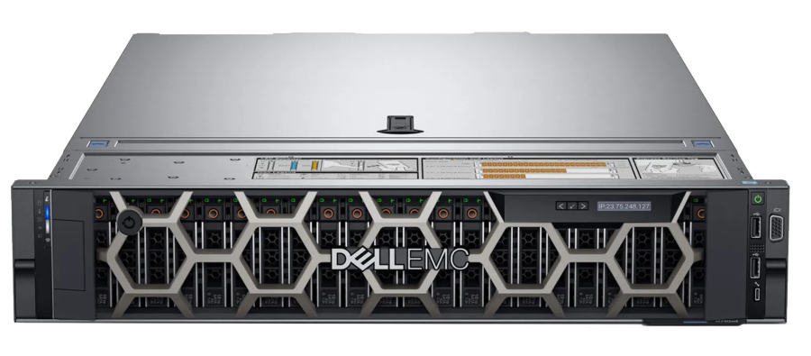

En total, la empresa disposa de 7 servidors:
- Servidor LDAP
- Servidor de BDD
- Servidor de centralització de logs
- Servidor web / sftp
- Servidor d’àudio
- Servidor de vídeo
- Servidor de videoconferència


### 1.3.2 Distribució racks

Hem decidit que per al nostre CPD farem servir 2 racks:
- Rack 1: serveis crítics (més importants per a la infraestructura)
  - Patch Panel
  - Switch ToR A
  - Switch ToR B
  - Router
  - Firewall
  - Servidor LDAP
  - Servidor BDD
  - Servidor Logs
  - PDU A
  - PDU B
  - SAI A
  - SAI B

- Rack 2: serveis multimedia (generen més tràfic i estàn més exposats)
  - Patch Panel
  - Switch ToR A
  - Switch ToR B
  - Servidor Web + SFTP
  - Servidor Audio
  - Servidor Video
  - Servudor Videoconferència
  - PDU A
  - PDU B
  - SAI A
  - SAI B

  Cada rack incorporarà l’arquitectura ToR, amb dos switches redundants, i utilitzarà SAIs N+1 (2 SAIs x rack).
  
- Els servidors disposen de dues fonts d’energia connectades a PDUs diferents per evitar fallades en cascada.


### 1.3.3 Planells / diagrames distribució racks

Esquema de distribució dels racks:

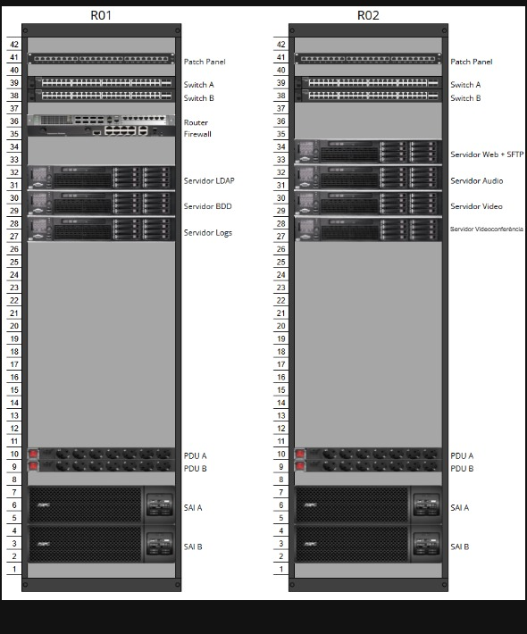
 
## 1.4 Infraestructura elèctrica \ d'alimentació redundant

El CPD incorpora una arquitectura elèctrica redundant dissenyada per garantir la continuïtat del servei davant qualsevol incidència en el subministrament elèctric.

L’arquitectura es basa en els següents components:

- Doble línia d’alimentació independent per reduir punts únics de fallada.
- Generador de suport per a talls elèctrics prolongats.
- Sistema ATS que commuta automàticament entre la xarxa elèctrica principal i el generador.
- SAIs en configuració redundant N+1 per mantenir l’operativitat durant microtalls o durant el temps de resposta del generador.
- PDUs redundants dins de cada rack per distribuir l’energia de manera equilibrada i segura. 

Aquesta combinació garanteix una disponibilitat elevada pròpia d’un entorn Tier III, evitant interrupcions del servei i permetent manteniment sense aturada.

 
## 1.5 Seguretat Física

### 1.5.1 Control d’accés

L’accés a la sala del CPD està estrictament restringit a personal autoritzat mitjançant sistemes d’identificació electrònica (targeta o credencials). 
La porta d’accés disposa de pany electrònic i registre d’entrades i sortides per garantir la traçabilitat. 

### 1.5.2 Videovigilància

El CPD compta amb un sistema de videovigilància permanent (CCTV) que cobreix totes les zones d’accés i l’interior de la sala. 
Les gravacions es mantenen emmagatzemades per a possibles auditories de seguretat.

### 1.5.3 Sistemes de prevenció, detecció i d’extinció d’incendis

El sistema de protecció contra incendis inclou:

- Sensors de fum i temperatura distribuïts per sostre tècnic.
- Extinció automàtica mitjançant agents nets (gas) per evitar danys als equips electrònics.
- 2 Extintors

Aquest sistema permet detectar i actuar sobre qualsevol incident abans que es propagui.


### 1.5.4 Diagrama de la seguretat física

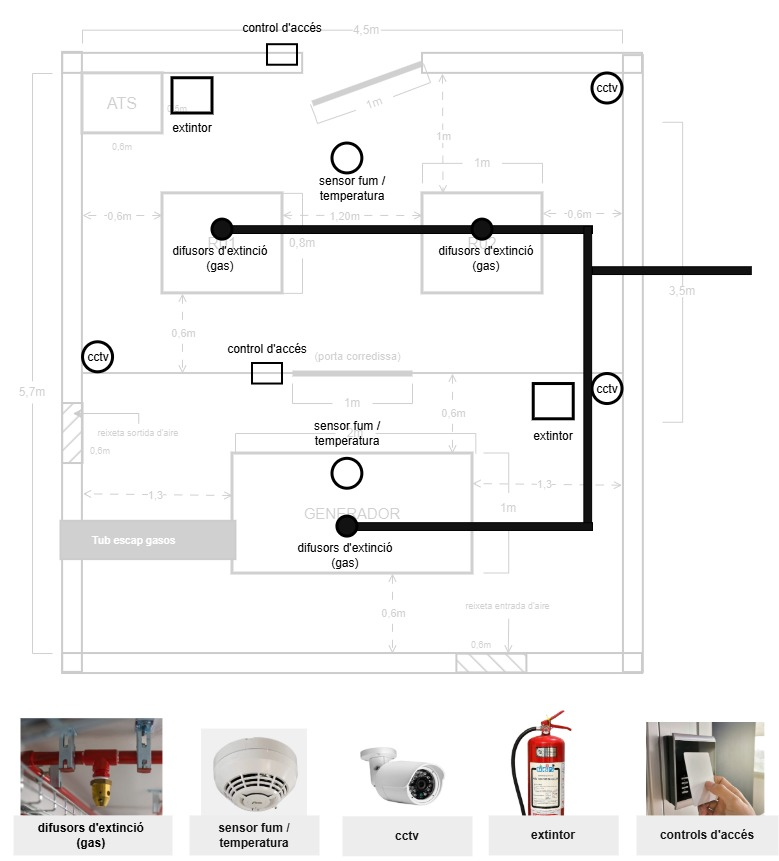

 
## 1.6 Seguretat Lògica

### 1.6.1 Restricció d’accés per autorització

L’accés als sistemes està restringit mitjançant autenticació d’usuaris, integrant LDAP per a la gestió centralitzada de credencials. Només els usuaris autoritzats poden accedir als serveis interns del CPD. 

### 1.6.2 Firewall

El CPD incorpora un firewall perimetral encarregat de:
- Filtrar trànsit entrant i sortint.
- Protegir els serveis interns.
- Aplicar polítiques de seguretat i segmentació de xarxa.
- Bloquejar accessos no autoritzats.


### 1.6.3 Monitorizació

El sistema disposa de monitorització centralitzada dels servidors i serveis, permetent:
- Supervisió en temps real.
- Alertes en cas d’errors o saturació.
- Registre d’esdeveniments (logs) centralitzats.


### 1.6.4 Còpies de seguretat / backups

S’implementa una estratègia de backups periòdics per garantir la recuperació de dades en cas d’incidència. 
Aquestes còpies es realitzen de manera automatitzada i es poden emmagatzemar en sistemes externs o aïllats per major seguretat. 


### 1.6.5 RAIDs

Els servidors utilitzen sistemes RAID per assegurar la integritat i disponibilitat de les dades. 

Aquest sistema permet:
- Redundància d’emmagatzematge.
- Recuperació davant fallades de discs.
- Millora del rendiment en lectura/escriptura segons configuració.

 
## 1.7 Prevenció de riscos laborals
 
Mesures aplicades en matèria de prevenció de RRLL en el CPD:

- Risc elèctric:
  - SAIs, PDUs i doble línia d’alimentació per evitar talls i manipulacions en càrrega.
  - Posada a terra de tots els equips.
  - Cablejat ordenat, canalitzat i etiquetat.

- Seguretat física
  - Passadissos lliures i amplis per manteniment segur.
  - Terra tècnic per evitar cables exposats.
  - Racks fixats i estabilitzats.
  - Il·luminació adequada.

- Riscos ambientals
  - Climatització redundant (2 sistemes).
  - Control de temperatura i humitat.
  - Sensors ambientals constants.

- Incendis
  - Detecció de fum i temperatura.
  - Extinció automàtica amb agents nets.
  - Vies d’evacuació senyalitzades i accessibles.

- Organització i protocols
  - Accés restringit amb control d’identitat.
  - Registre d’accessos.
  - Formació del personal en seguretat CPD.
  - Procediments de manteniment definits.


## 1.8 Implementació del CPD al núvol AWS [⬆](#índex)

### 1.8.1 Arquitectura AWS

La infraestructura de producció s'ha desplegat íntegrament a **Amazon EC2** (sense RDS ni AMIs del marketplace), seguint el principi de màxim control sobre el sistema operatiu i la configuració.
 
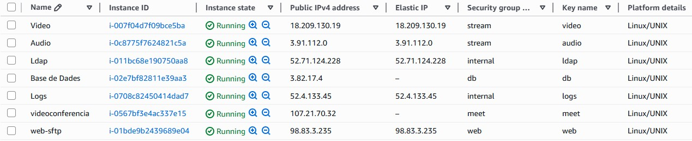
 
> Cada servei resideix en una instància independent, a excepció del servei web i SFTP que cohabiten a `srv-web-ftps`.
 
### 1.8.2 Accés mitjançant clau privada i pública / creació usuari administratiu


**Pas 1 — Generar el parell de claus a la màquina local** (si no existeix ja):
 
```bash
ssh-keygen -t rsa -b 4096
# Genera:
#   ~/.ssh/id_rsa       → clau privada (no compartir mai)
#   ~/.ssh/id_rsa.pub   → clau pública
```
 
**Pas 2 — Instal·lar la clau pública a la instància** (des de la màquina local):
 
```bash
ssh-copy-id -i ~/.ssh/id_rsa.pub usuari@IP_INSTANCIA
```
 
O manualment des de la instància:
 
```bash
mkdir -p ~/.ssh
chmod 700 ~/.ssh
echo "ssh-rsa AAAA..." >> ~/.ssh/authorized_keys
chmod 600 ~/.ssh/authorized_keys
```
 
**Pas 3 — Verificar l'accés sense contrasenya:**
 
```bash
ssh emilia@10.0.6.239
# Welcome to Ubuntu...  → connexió establerta sense password
```

 
Per permetre que Ansible executi tasques privilegiades de forma no interactiva, l'usuari d'administració necessita `NOPASSWD` al sudoers:
 
```bash
sudo visudo
```
 
Afegir al final del fitxer:
 
```
# Permisos d'administració sense contrasenya (necessari per a Ansible)
emilia  ALL=(ALL) NOPASSWD:ALL
```
 
> **Nota de seguretat:** Aquesta configuració s'aplica únicament als usuaris d'administració del projecte, en un entorn de laboratori controlat. En producció real, s'hauria de restringir a les comandes estrictament necessàries.
 
---

Totes les instàncies EC2 del projecte segueixen el mateix patró d'accés: **un usuari d'administració dedicat per màquina**, autenticat exclusivament per clau pública RSA. No s'utilitza mai l'usuari per defecte (`ubuntu`) ni l'autenticació per contrasenya.
 
El procediment és idèntic per a totes les màquines. A continuació s'il·lustra amb l'usuari `emilia` al servidor de logs (per a la resta de màquines, substituir el nom d'usuari corresponent).
 
```bash
# Crear el nou usuari d'administració
sudo adduser emilia
 
# Afegir-lo al grup sudo
sudo usermod -aG sudo emilia
 
# Canviar a l'usuari creat
su - emilia
```
 
 
### 1.8.3 SRV web / sftp (ansible)


1. Actualitzar i instal·lar Nginx

```bash
sudo apt update
sudo apt upgrade
sudo apt install nginx
```

2. Verificació

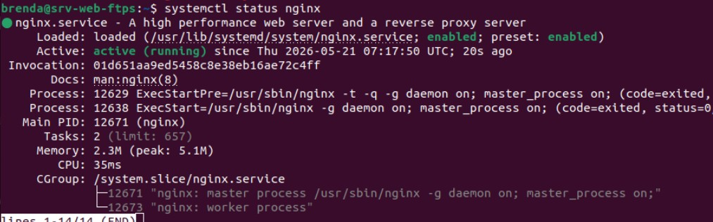

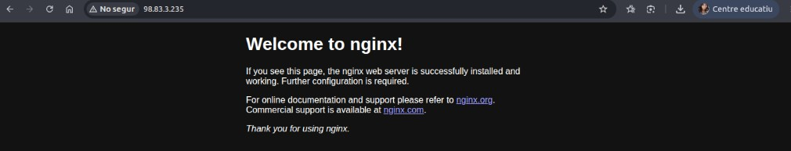

Modificar /var/www/html/index.html per editar la web.

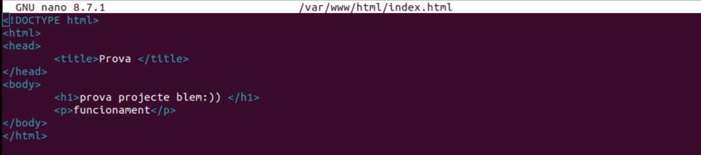

`sudo systemctl reload nginx`

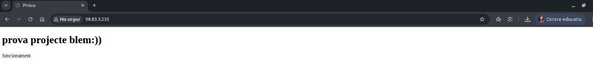
 
#### 1.8.3.3 SFTP

1. Actualitzar i instal·lar ldap

```bash
sudo apt update
sudo apt install -y sssd sssd-ldap libpam-sss libnsss ldap-utils enssh-server
dpkg -l sssd sssd-ldap libpam -sss libnss-sss openssh-server
```

2. Configurar el fitxer /etc/ssd/sssd.conf amb el nostre domini ldap

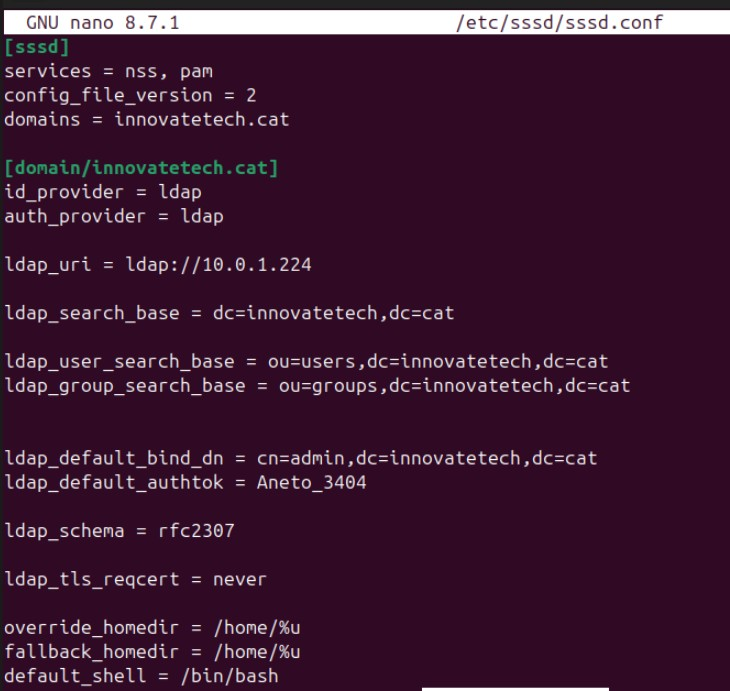
 
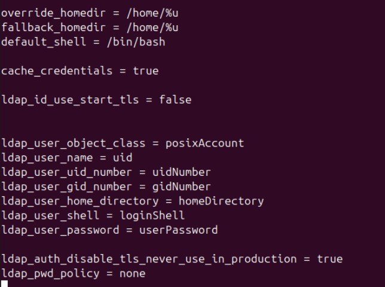

```bash
sudo chmod 600 /etc/sssd/sssd.conf
sudo chown root:root /etc/sssd/sssd.conf
```
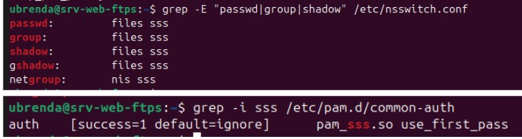

2. Configurar el fitxer /etc/ssh/sshd_config

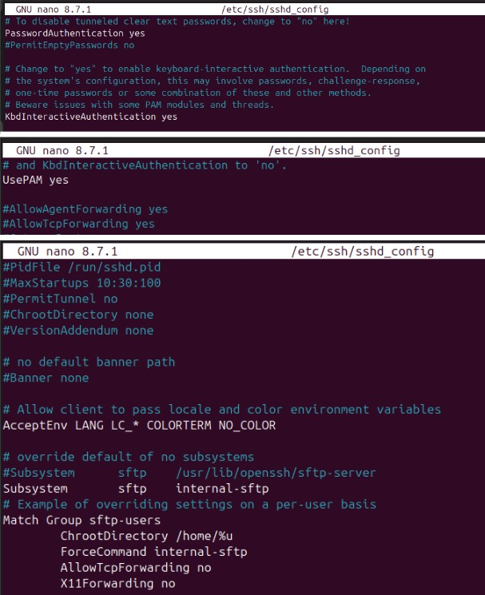


3. Crear una carpeta per a cada usuari i configurar els permisos i propietaris adïents

```bash
sudo mkdir -p /home/brenda/files
sudo chown root:root /home/brenda
sudo chmod 755 /home/brenda
sudo chown brenda:brenda /home/brenda/files
sudo chmod 700 /home/brenda/files
```
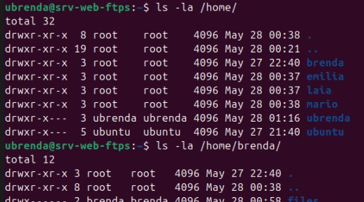

4. Afegir als usuaris al grup sftp-users

`sudo usermod -aG sftp-users brenda`

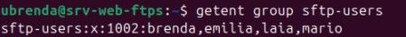

5. Validació:

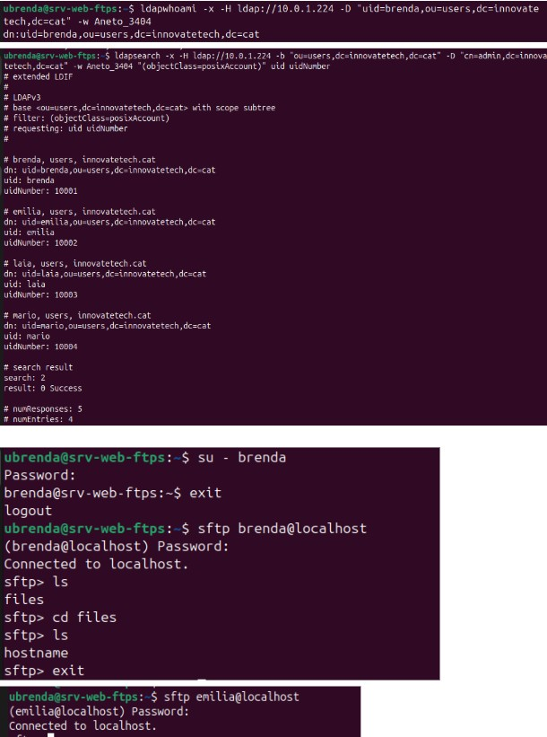

6. Instal·lar ansible i crear playbook per a la instalació + configuració de servei web i sftp

`sudo apt install -y ansible`

`sudo nano playbook-sftp.yml`

Contingut playbook:

```bash
- name: Configuració Web + SFTP amb autenticació LDAP - InnovateTech
  hosts: localhost
  connection: local
  become: true

  vars:
    ldap_uri: "ldap://10.0.1.224"
    ldap_public_uri: "ldap://52.71.124.228"
    ldap_base_dn: "dc=innovatetech,dc=cat"
    ldap_admin_dn: "cn=admin,dc=innovatetech,dc=cat"
    ldap_admin_password: "Aneto_3404"
    sftp_users:
      - { name: brenda, uid: 10001, gid: 10001 }
      - { name: emilia, uid: 10002, gid: 10002 }
      - { name: laia,   uid: 10003, gid: 10003 }
      - { name: mario,  uid: 10004, gid: 10004 }

  tasks:

    # ============================================================
    # BLOC 1 — INSTAL·LACIÓ DE PAQUETS
    # ============================================================
    - name: Instal·lar paquets web i SFTP
      apt:
        name:
          - nginx
          - php-fpm
          - php-ldap
          - php-mysql
          - sssd
          - sssd-ldap
          - libpam-sss
          - libnss-sss
          - ldap-utils
          - openssh-server
        state: present
        update_cache: true

    # ============================================================
    # BLOC 2 — CONFIGURACIÓ NGINX
    # ============================================================
    - name: Desplegar configuració Nginx
      copy:
        dest: /etc/nginx/sites-enabled/default
        owner: root
        group: root
        mode: '0644'
        content: |
          server {
              listen 80;
              root /var/www/html;
              index index.php;

              location / {
                  try_files $uri $uri/ /index.php;
              }

              location ~ \.php$ {
                  include snippets/fastcgi-php.conf;
                  fastcgi_pass unix:/run/php/php-fpm.sock;
              }
          }
      notify: Reiniciar Nginx

    # ============================================================
    # BLOC 3 — FITXERS PHP DE LA WEB
    # ============================================================
    - name: Desplegar index.php
      copy:
        dest: /var/www/html/index.php
        owner: www-data
        group: www-data
        mode: '0644'
        content: |
          <?php
          session_start();

          if(!isset($_SESSION['user'])){
              header("Location: login.php");
              exit();
          }

          $user=$_SESSION['user'];
          ?>

          <html>
          <head>
              <link rel="stylesheet" href="style.css">
          </head>

          <body>

          <h1>G01 ASIXc1C - InnovateTech Portal</h1>

          <div class="user">
              Usuari LDAP: <?php echo $user; ?>
          </div>

          <div class="grid">

              <!-- AUDIO -->
              <div class="card">
                  <h2>Streaming Àudio</h2>
                  <audio controls>
                      <source src="http://3.91.112.0:8000/streaming_directe.mp3">
                  </audio>

                  <h2 style="margin-top:20px;">Vídeo</h2>
                  <iframe class="video-small"
                      src="http://18.209.130.19/player.html">
                  </iframe>
              </div>

              <!-- VIDEOCONFERÈNCIA BUTTON -->
              <div class="card">
                  <h2>Videoconferència</h2>
                  <a href="https://g01asixc1c-videoconferencia.duckdns.org" target="_blank">
                      <button>Entrar a videoconferència</button>
                  </a>
              </div>

              <!-- KIBANA -->
              <div class="card">
                  <h2>Kibana</h2>
                  <iframe src="http://52.4.133.45:5601" height="450"></iframe>
              </div>

          </div>

          <!-- BD -->
          <div class="card">

          <h2>Base de Dades: innovatetech_db</h2>

          <?php

          $conn=new mysqli(
              "34.203.238.96",
              "root",
              "pirineus"
          );

          if($conn->connect_error){
              die("<h3>Error BD: ".$conn->connect_error."</h3>");
          }

          $conn->select_db("innovatetech_db");

          $tables=$conn->query("SHOW TABLES");

          while($t=$tables->fetch_array()){

              $table=$t[0];

              echo "<h3>Taula: $table</h3>";

              $structure=$conn->query("DESCRIBE `$table`");

              echo "<table><tr><th>Field</th><th>Type</th><th>Null</th><th>Key</th></tr>";

              while($f=$structure->fetch_assoc()){
                  echo "<tr>
                      <td>{$f['Field']}</td>
                      <td>{$f['Type']}</td>
                      <td>{$f['Null']}</td>
                      <td>{$f['Key']}</td>
                  </tr>";
              }

              echo "</table>";

              $rows=$conn->query("SELECT * FROM `$table` LIMIT 15");

              if($rows){

                  echo "<table><tr>";

                  foreach($rows->fetch_fields() as $col){
                      echo "<th>{$col->name}</th>";
                  }

                  echo "</tr>";

                  while($r=$rows->fetch_assoc()){
                      echo "<tr>";
                      foreach($r as $v){
                          echo "<td>".htmlspecialchars($v)."</td>";
                      }
                      echo "</tr>";
                  }

                  echo "</table>";
              }
          }

          ?>

          </div>

          <br>

          <a href="logout.php">
              <button>Logout</button>
          </a>

          </body>
          </html>

    - name: Desplegar login.php
      copy:
        dest: /var/www/html/login.php
        owner: www-data
        group: www-data
        mode: '0644'
        content: |
          <?php
          session_start();
          $ldap_server="ldap://52.71.124.228";
          $base_dn="dc=innovatetech,dc=cat";
          if($_POST){
              $user=$_POST['username'];
              $pass=$_POST['password'];
              $conn=ldap_connect($ldap_server);
              ldap_set_option($conn,LDAP_OPT_PROTOCOL_VERSION,3);
              $search=ldap_search($conn,$base_dn,"(uid=$user)");
              $entries=ldap_get_entries($conn,$search);
              if($entries["count"]>0){
                  $dn=$entries[0]["dn"];
                  if(@ldap_bind($conn,$dn,$pass)){
                      $_SESSION['user']=$user;
                      header("Location:index.php");
                      exit();
                  }
              }
              $error="Login incorrecte";
          }
          ?>
          <form method="POST">
              <input name="username" placeholder="Usuari">
              <input type="password" name="password" placeholder="Password">
              <button>Login</button>
          </form>
          <?php if(isset($error)) echo $error; ?>

    - name: Desplegar logout.php
      copy:
        dest: /var/www/html/logout.php
        owner: www-data
        group: www-data
        mode: '0644'
        content: |
          <?php
          session_start();
          session_destroy();
          header("Location: login.php");
          exit();
          ?>

    - name: Desplegar style.css
      copy:
        dest: /var/www/html/style.css
        owner: www-data
        group: www-data
        mode: '0644'
        content: |
          body{
              background:#0f172a;
              color:white;
              font-family:Arial;
              margin:0;
              padding:30px;
          }
          h1{
              text-align:center;
              font-size:40px;
              margin-bottom:10px;
          }
          .user{
              text-align:center;
              margin-bottom:30px;
              color:#93c5fd;
              font-size:18px;
          }
          .grid{
              display:grid;
              grid-template-columns:repeat(auto-fit,minmax(500px,1fr));
              gap:20px;
          }
          .card{
              background:#1e293b;
              padding:20px;
              border-radius:15px;
              margin-bottom:20px;
          }
          iframe{
              width:100%;
              border:none;
              border-radius:10px;
          }
          audio{
              width:100%;
          }
          .video-small{
              height:360px;
          }
          button{
              background:#2563eb;
              color:white;
              border:none;
              padding:12px 20px;
              border-radius:8px;
              cursor:pointer;
              font-size:15px;
          }
          table{
              width:100%;
              border-collapse:collapse;
              background:white;
              color:black;
          }
          th,td{
              border:1px solid #ccc;
              padding:6px;
          }
          th{
              background:#ddd;
          }

    # ============================================================
    # BLOC 4 — CONFIGURACIÓ SSSD
    # ============================================================
    - name: Crear directori /etc/sssd/pki
      file:
        path: /etc/sssd/pki
        state: directory
        owner: root
        group: root
        mode: '0711'

    - name: Desplegar sssd.conf
      copy:
        dest: /etc/sssd/sssd.conf
        owner: root
        group: root
        mode: '0600'
        content: |
          [sssd]
          services = nss, pam
          config_file_version = 2
          domains = innovatetech.cat

          [domain/innovatetech.cat]
          id_provider = ldap
          auth_provider = ldap

          ldap_uri = {{ ldap_uri }}
          ldap_search_base = {{ ldap_base_dn }}
          ldap_user_search_base = ou=users,{{ ldap_base_dn }}
          ldap_group_search_base = ou=groups,{{ ldap_base_dn }}

          ldap_default_bind_dn = {{ ldap_admin_dn }}
          ldap_default_authtok = {{ ldap_admin_password }}

          ldap_schema = rfc2307
          ldap_tls_reqcert = never
          ldap_id_use_start_tls = false
          ldap_auth_disable_tls_never_use_in_production = true
          ldap_pwd_policy = none

          ldap_user_object_class = posixAccount
          ldap_user_name = uid
          ldap_user_uid_number = uidNumber
          ldap_user_gid_number = gidNumber
          ldap_user_home_directory = homeDirectory
          ldap_user_shell = loginShell
          ldap_user_password = userPassword

          override_homedir = /home/%u
          fallback_homedir = /home/%u
          default_shell = /bin/bash
          cache_credentials = true
      notify: Reiniciar SSSD

    # ============================================================
    # BLOC 5 — CONFIGURACIÓ NSS i PAM
    # ============================================================
    - name: Configurar nsswitch.conf
      lineinfile:
        path: /etc/nsswitch.conf
        regexp: "^{{ item }}:"
        line: "{{ item }}:         files sss"
      loop:
        - passwd
        - group
        - shadow
      notify: Reiniciar SSSD

    - name: Activar pam_mkhomedir
      lineinfile:
        path: /etc/pam.d/common-session
        line: "session optional        pam_mkhomedir.so skel=/etc/skel umask=077"
        state: present

    # ============================================================
    # BLOC 6 — CONFIGURACIÓ SSHD
    # ============================================================
    - name: Desplegar sshd_config
      copy:
        dest: /etc/ssh/sshd_config
        owner: root
        group: root
        mode: '0644'
        content: |
          Include /etc/ssh/sshd_config.d/*.conf
          PasswordAuthentication yes
          KbdInteractiveAuthentication yes
          UsePAM yes
          PubkeyAuthentication yes
          PermitRootLogin prohibit-password
          PrintMotd no
          AcceptEnv LANG LC_*
          Subsystem sftp internal-sftp
          Match Group sftp-users
              ChrootDirectory /home/%u
              ForceCommand internal-sftp
              AllowTcpForwarding no
              X11Forwarding no
      notify: Reiniciar SSH

    # ============================================================
    # BLOC 7 — GRUP I DIRECTORIS SFTP
    # ============================================================
    - name: Crear grup sftp-users
      group:
        name: sftp-users
        state: present

    - name: Assegurar SSSD actiu abans de crear directoris
      systemd:
        name: sssd
        state: started
        enabled: true

    - name: Esperar que SSSD estigui llest
      wait_for:
        timeout: 5

    - name: Crear directori home de cada usuari
      file:
        path: "/home/{{ item.name }}"
        state: directory
        owner: root
        group: root
        mode: '0755'
      loop: "{{ sftp_users }}"

    - name: Crear subdirectori files per a cada usuari
      file:
        path: "/home/{{ item.name }}/files"
        state: directory
        owner: "{{ item.uid }}"
        group: "{{ item.gid }}"
        mode: '0700'
      loop: "{{ sftp_users }}"

    - name: Afegir usuaris al grup sftp-users
      command: "usermod -aG sftp-users {{ item.name }}"
      loop: "{{ sftp_users }}"
      register: usermod_result
      failed_when: usermod_result.rc != 0 and "does not exist" not in usermod_result.stderr
      changed_when: usermod_result.rc == 0

    # ============================================================
    # BLOC 8 — NETEJAR CACHÉ SSSD
    # ============================================================
    - name: Netejar caché SSSD
      file:
        path: "{{ item }}"
        state: absent
      loop:
        - /var/lib/sss/db
        - /var/lib/sss/mc
      notify: Reiniciar SSSD

    - name: Recrear directoris caché SSSD
      file:
        path: "{{ item }}"
        state: directory
        owner: sssd
        group: sssd
        mode: '0700'
      loop:
        - /var/lib/sss/db
        - /var/lib/sss/mc

    # ============================================================
    # BLOC 9 — ASSEGURAR SERVEIS ACTIUS
    # ============================================================
    - name: Assegurar Nginx actiu
      systemd:
        name: nginx
        state: started
        enabled: true

    - name: Assegurar PHP-FPM actiu
      systemd:
        name: php8.5-fpm
        state: started
        enabled: true

    - name: Assegurar SSSD actiu
      systemd:
        name: sssd
        state: started
        enabled: true

    - name: Assegurar SSH actiu
      systemd:
        name: ssh
        state: started
        enabled: true

  handlers:
    - name: Reiniciar Nginx
      systemd:
        name: nginx
        state: restarted

    - name: Reiniciar SSSD
      systemd:
        name: sssd
        state: restarted

    - name: Reiniciar SSH
      systemd:
        name: ssh
        state: restarted
```
7. Validació:

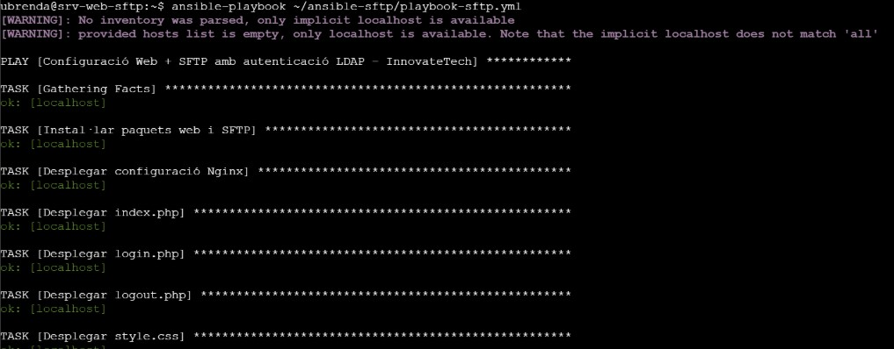

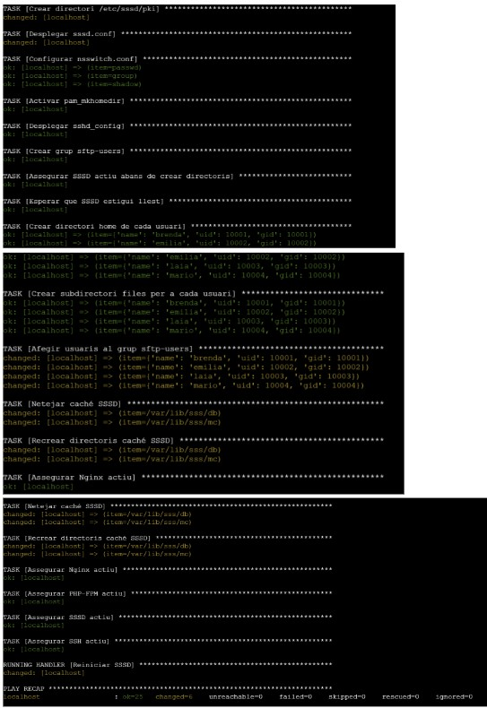

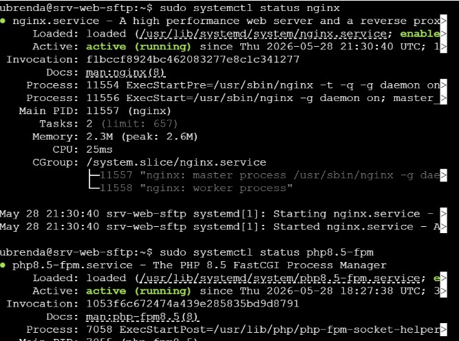

### 1.8.4 SRV LDAP

1. Instal·lar i configurar LDAP

```
sudo apt update
sudo apt upgrade
sudo apt install slapd ldap-utils -y
sudo dpkg-reconfigure slapd
```
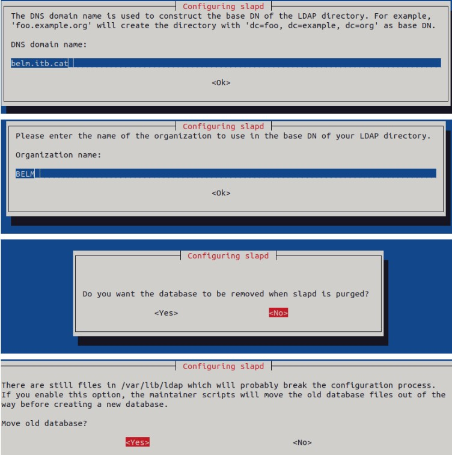
 
2. Validació

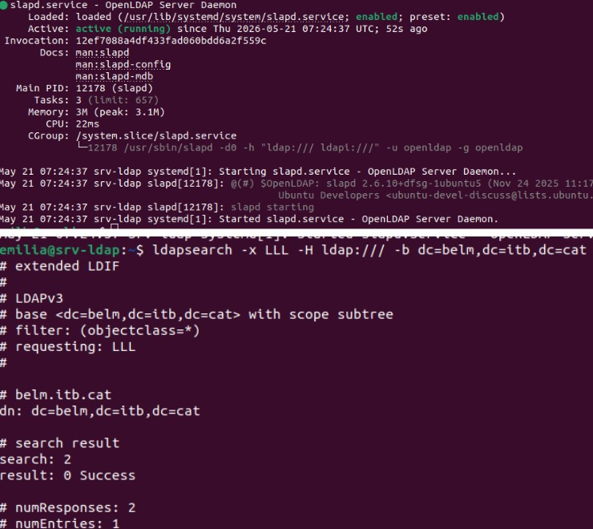


3. Creació objectes, usuaris i contrasenya

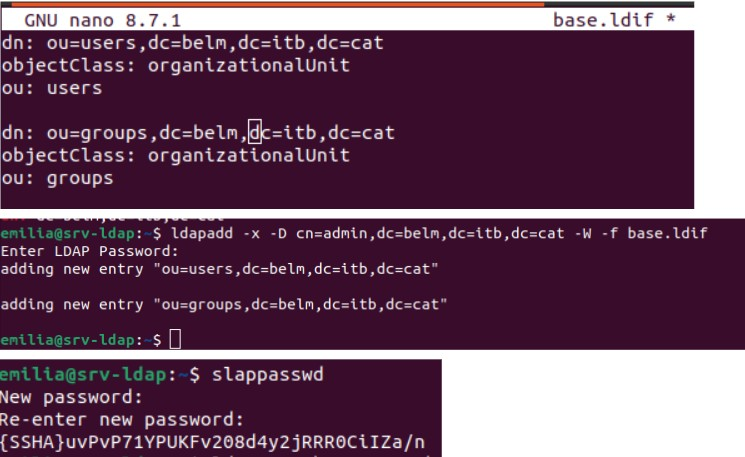

Afegir tots els usuaris que nem a crear a users.ldif, i després executar-lo.

users.ldif

```
dn: cn=brenda,ou=groups,dc=innovatetech,dc=cat
objectClass: posixGroup
cn: brenda
gidNumber: 10001
 
dn: cn=emilia,ou=groups,dc=innovatetech,dc=cat
objectClass: posixGroup
cn: emilia
gidNumber: 10002
 
dn: cn=laia,ou=groups,dc=innovatetech,dc=cat
objectClass: posixGroup
cn: laia
gidNumber: 10003
 
dn: cn=mario,ou=groups,dc=innovatetech,dc=cat
objectClass: posixGroup
cn: mario
gidNumber: 10004
```


4. Validació

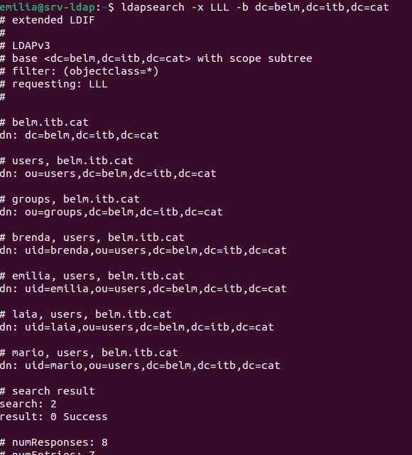


### 1.8.5 SRV Logs
 
6. Instal·lar ansible i crear playbook per a la instalació + configuració de servei de logs

`sudo apt install -y ansible`

`sudo nano elk.yml`

Contingut playbook:
 
```
---
- name: Configurar Servidor Central de Logs (Rsyslog + ELK Stack)
  hosts: localhost
  become: yes
  tasks:
 
  # ── 1. PREREQUISITS I REPOSITORIS ──────────────────────────────────────────
    - name: Instal·lar dependències bàsiques
      apt:
        name: [apt-transport-https, gnupg2, curl]
        state: present
        update_cache: yes
 
    - name: Eliminar clau GPG anterior si existeix
      file:
        path: /usr/share/keyrings/elasticsearch-keyring.gpg
        state: absent
 
    - name: Descarregar i desencriptar la clau GPG d'Elastic
      shell: |
        curl -fsSL https://artifacts.elastic.co/GPG-KEY-elasticsearch \
          | gpg --dearmor -o /usr/share/keyrings/elasticsearch-keyring.gpg
      args:
        creates: /usr/share/keyrings/elasticsearch-keyring.gpg
 
    - name: Assegurar permisos correctes a la clau GPG
      file:
        path: /usr/share/keyrings/elasticsearch-keyring.gpg
        mode: '0644'
        owner: root
        group: root
 
    - name: Afegir el repositori oficial d'Elastic 7.x
      apt_repository:
        repo: deb [signed-by=/usr/share/keyrings/elasticsearch-keyring.gpg] https://artifacts.elastic.co/packages/7.x/apt stable main
        state: present
        filename: elastic-7.x
 
  # ── 2. CONFIGURACIÓ DE RSYSLOG ──────────────────────────────────────────────
    - name: Assegurar el directori de logs remots amb permisos correctes
      file:
        path: /var/log/remote
        state: directory
        owner: syslog
        group: adm
        mode: '0755'
 
    - name: Habilitar recepció UDP a Rsyslog
      lineinfile:
        path: /etc/rsyslog.conf
        regexp: '^#module\(load="imudp"\)'
        line: 'module(load="imudp")'
      notify: Reiniciar rsyslog
 
    - name: Habilitar recepció TCP 514 a Rsyslog
      lineinfile:
        path: /etc/rsyslog.conf
        regexp: '^#input\(type="imtcp" port="514"\)'
        line: 'input(type="imtcp" port="514")'
      notify: Reiniciar rsyslog
 
    - name: Crear la plantilla de separació de logs per hostname
      copy:
        dest: /etc/rsyslog.d/remote.conf
        content: |
          $template RemoteLogs,"/var/log/remote/%HOSTNAME%.log"
          *.* ?RemoteLogs
          & stop
      notify: Reiniciar rsyslog
 
  # ── 3. ELASTICSEARCH ────────────────────────────────────────────────────────
    - name: Instal·lar Elasticsearch
      apt:
        name: elasticsearch
        state: present
 
    - name: Configurar Elasticsearch per escoltar localment
      lineinfile:
        path: /etc/elasticsearch/elasticsearch.yml
        regexp: '^#?network.host:'
        line: 'network.host: 127.0.0.1'
      notify: Reiniciar elasticsearch
 
    - name: Assegurar que Elasticsearch està actiu i s'inicia amb el sistema
      service:
        name: elasticsearch
        state: started
        enabled: yes
 
  # ── 4. KIBANA ───────────────────────────────────────────────────────────────
    - name: Instal·lar Kibana
      apt:
        name: kibana
        state: present
 
    - name: Configurar Kibana per ser accessible externament
      lineinfile:
        path: /etc/kibana/kibana.yml
        regexp: '^#?server.host:'
        line: 'server.host: "0.0.0.0"'
      notify: Reiniciar kibana
 
    - name: Connectar Kibana amb Elasticsearch local
      lineinfile:
        path: /etc/kibana/kibana.yml
        regexp: '^#?elasticsearch.hosts:'
        line: 'elasticsearch.hosts: ["http://localhost:9200"]'
      notify: Reiniciar kibana
 
    - name: Assegurar que Kibana està actiu i s'inicia amb el sistema
      service:
        name: kibana
        state: started
        enabled: yes
 
  # ── 5. FILEBEAT ─────────────────────────────────────────────────────────────
    - name: Instal·lar Filebeat
      apt:
        name: filebeat
        state: present
 
    - name: Configurar Filebeat per llegir /var/log/remote/
      copy:
        dest: /etc/filebeat/filebeat.yml
        content: |
          filebeat.inputs:
          - type: log
            enabled: true
            paths:
              - /var/log/remote/*.log
 
          output.elasticsearch:
            hosts: ["localhost:9200"]
      notify: Reiniciar filebeat
 
    - name: Assegurar que Filebeat està actiu i s'inicia amb el sistema
      service:
        name: filebeat
        state: started
        enabled: yes
 
  # ── HANDLERS ────────────────────────────────────────────────────────────────
  handlers:
    - name: Reiniciar rsyslog
      service: { name: rsyslog, state: restarted }
    - name: Reiniciar elasticsearch
      service: { name: elasticsearch, state: restarted }
    - name: Reiniciar kibana
      service: { name: kibana, state: restarted }
    - name: Reiniciar filebeat
      service: { name: filebeat, state: restarted }
```

Executar el playbook a tots els servers.
 
7. Validació:

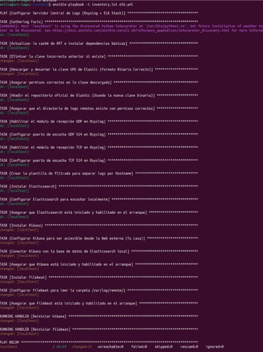


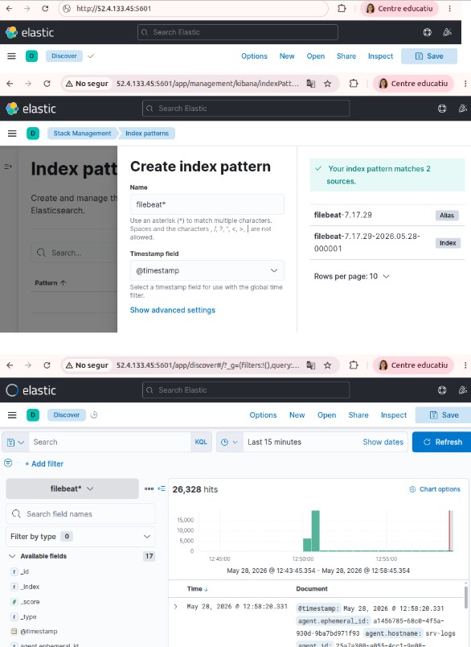


# 2. Implantació dels serveis d'àudio i vídeo [⬆](#índex)
 
## 2.1 Descripció general [⬆](#índex)

Servei video:
- NGINX → servidor principal. Per fer pagines web, enviar videos y gestionar streaming
- RTMP → protocol per enviar video al servidor.
- HLS → protocol per VEURE video des de el navegador

Servei videoconferencia:
- Jitsi Meet
- WebRTC

Servei audio:
- MP3
- Icecast

 
## 2.2 Servei d'àudio [⬆](#índex)
 
1. Instal·lar i configurar icecast

`sudo apt update`
`sudo apt install icecast2`

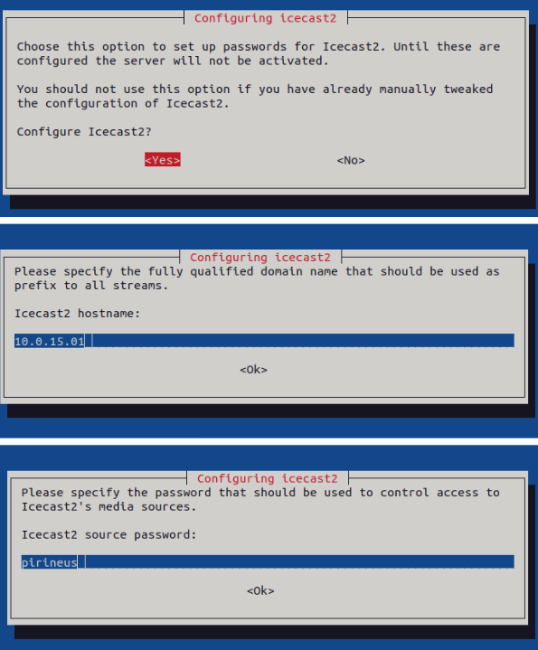

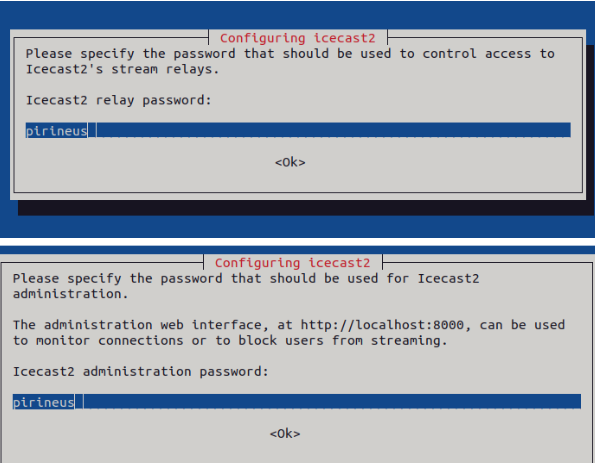

2. Activar i iniciar servei

`sudo systemctl enable --now icecast2`
`sudo systemctl start icecast2`

3. Comprovació de servei al navegador amb la ip pública i port d’àudio

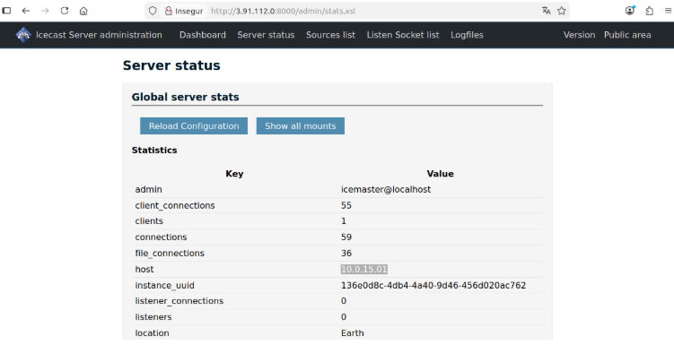


Streaming en directe (ffmpeg)

4. Instal·lar ffmpeg
 `sudo apt install ffmpeg`

5. Pujar mp3 a la carpeta home de l’usuari del servidor

`scp -i ~/Baixades/audio.pem canco.mp3 laia@3.91.112.0:/home/laia/`

6. Crear streaming.service per a que estigui sempre actiu

`sudo nano /etc/systemd/system/streaming.service`
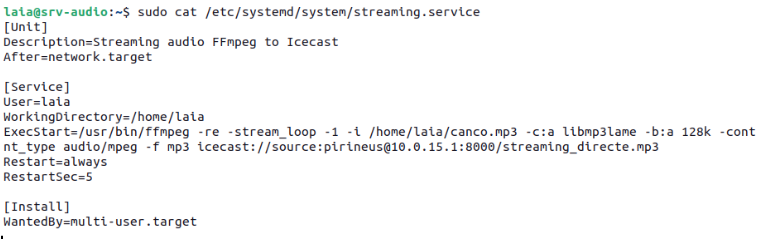

```
sudo systemctl daemon-reload
sudo systemctl enable streaming.service
sudo systemctl start streaming.service
```

7. Validació:

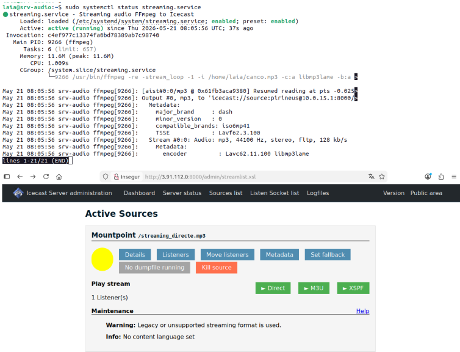


## 2.3 Servei de vídeo [⬆](#índex)
 
1. Instal·lar nginx i ffmpeg

```
sudo apt update
sudo apt install nginx libnginx-mod-rtmp -y
sudo apt install ffmpeg -y

sudo systemctl enable nginx
sudo systemctl start nginx

```

2. Configurar rtpm + hls a nginx

Afegir al final de /etc/nginx/nginx.conf :

```
rtmp {
    server {
        listen 1935;
        chunk_size 4096;

        application live {
            live on;

            hls on;
            hls_path /var/www/html/hls;
            hls_fragment 3;
        }
    }
```
`sudo systemctl status nginx`

3. Crear carpeta HLS per a que pugui guardar els .m3u8 i .ts


```
sudo mkdir -p /var/www/html/hls
sudo chown -R www-data:www-data /var/www/html/hls
sudo chmod -R 755 /var/www/html/hls

```

4. Crear config web per hls

/etc/nginx/sites-avaliable/hls :

```
server {
    listen 80;

    root /var/www/html;
    index player.html;

    location / {
        try_files $uri $uri/ =404;
    }

    location /hls {
        types {
            application/vnd.apple.mpegurl m3u8;
            video/mp2t ts;
        }

        root /var/www/html;
        add_header Cache-Control no-cache;
        add_header Access-Control-Allow-Origin *;
    }
}
```

`sudo ln -s /etc/nginx/sites-available/hls /etc/nginx/sites-enabled/`


5. Crear HTML (web)

/var/www/html/player.html


```
<!DOCTYPE html>
<html>
<head>
    <meta charset="UTF-8">
    <script src="https://cdn.jsdelivr.net/npm/hls.js@latest"></script>
</head>
<body>

<video id="video" controls width="800"></video>

<script>
const video = document.getElementById('video');
const videoSrc = 'http://18.209.130.19:80/hls/asixc1c_g01.m3u8';

if (Hls.isSupported()) {

    const hls = new Hls({
        autoStartLoad: true
    });

    hls.loadSource(videoSrc);
    hls.attachMedia(video);

    hls.on(Hls.Events.MANIFEST_PARSED, function () {

        video.play().catch(() => {

            console.log("Autoplay bloqueado");

        });

    });

} else if (video.canPlayType('application/vnd.apple.mpegurl')) {

    video.src = videoSrc;

}
</script>

</body>
</html>


```

6. Enviar video al server a una ruta fixe

`scp -i video.pem video.mp4 laia@18.209.130.19:/home/laia/`

```
sudo mkdir -p /opt/stream
sudo cp video.mp4 /opt/stream/
```

7. Crear servei streaming.service per a que s'arranqui sol i estigui empre actiu

/etc/systemd/system/streaming.service

```
[Unit]
Description=FFmpeg Video Streaming Service
After=network.target

[Service]
ExecStart=/usr/bin/ffmpeg -re -stream_loop -1 -i /opt/stream/video.mp4 -c:v libx264 -preset veryfast -tune zerolatency -c:a aac -ar 44100 -ac 2 -b:a 128k -f flv rtmp://localhost/live/asixc1c_g01
Restart=always
User=laia

[Install]
WantedBy=multi-user.target

```

```
sudo systemctl daemon-reload
sudo systemctl enable streaming.service
sudo systemctl start streaming.service

```

8. Validació:

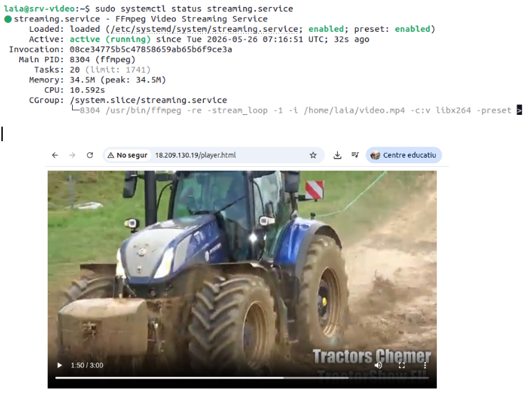


## 2.4 Servei de videoconferència [⬆](#índex)

1. Crear domini a partir de la IP pública (duckdns)

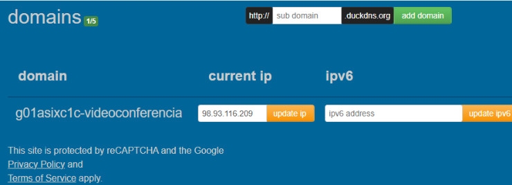


2. Instal·lar i configurar JITSI
```
sudo apt update
sudo apt install gnupg2 curl apt-transport-https -y
sudo apt update
sudo apt install jitsi-meet -y

```

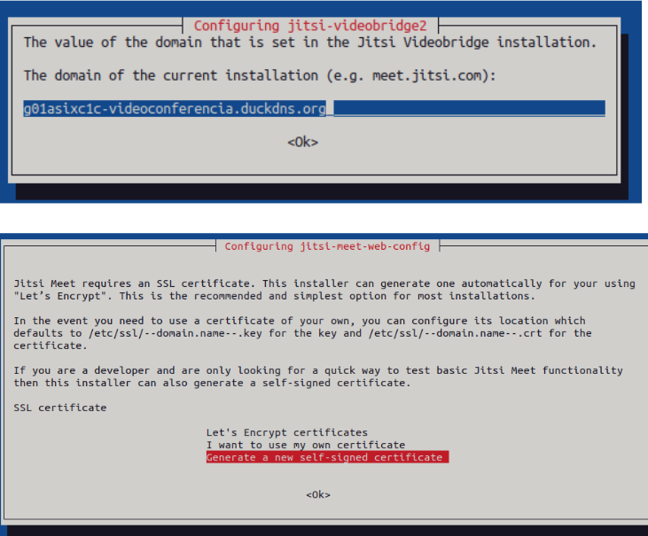


3. Validació:

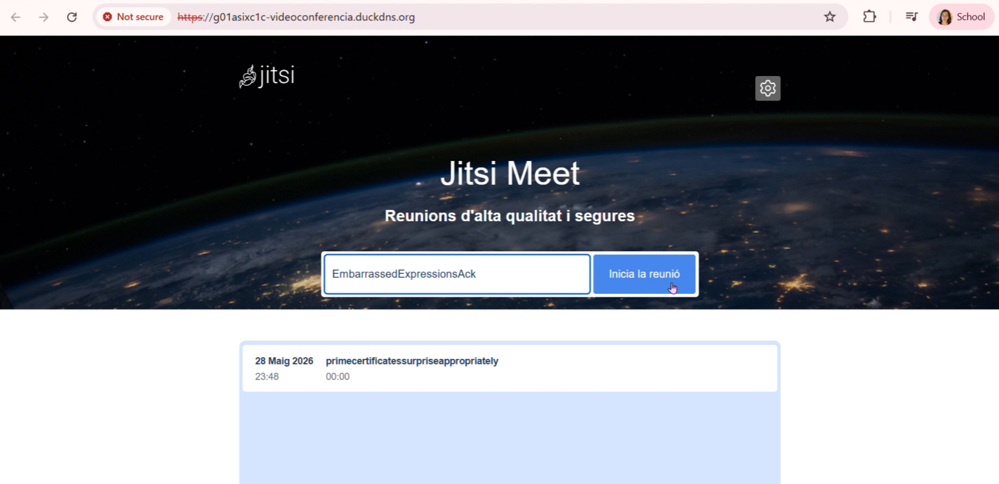

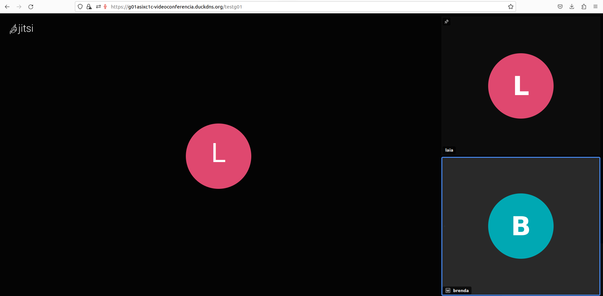


 
## 2.5 Comprovacions d'amplada de banda [⬆](#índex)
 
Instal·lar als servers speedtest

`sudo apt install speedtest-cli -y`

### 2.5.1 Rendiment de xarxa


Server de videoconferència:
- Latència: 3.818 ms
- Velocitat de dascàrrega: 4036,08 Mbit/s
- Velocitat de pujada: 3005,08 Mbit/s

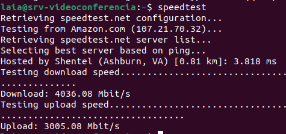


Server de video:
- Latència: 1.673 ms
- Velocitat de dascàrrega: 3482,75 Mbit/s
- Velocitat de pujada: 2681,24 Mbit/s

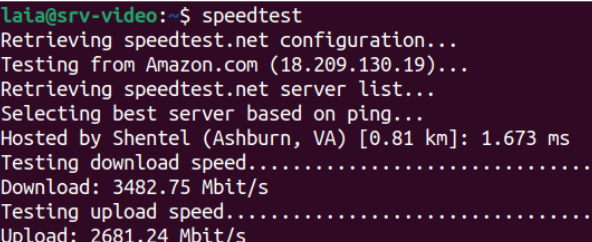

Server de audio:
- Latència: 1.911 ms
- Velocitat de dascàrrega: 944,15 Mbit/s
- Velocitat de pujada: 942,52 Mbit/s

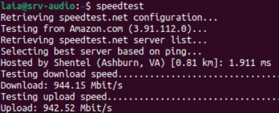

### 2.5.2 Anàlisi de comportament amb el consum dels serveis multimèdia

El servidor de videoconferència és el que consumeix més amplada de banda, ja que transmet àudio i vídeo en temps real.
El servidor de vídeo també presenta un consum elevat a causa de l’streaming multimèdia. 
Finalment, el servidor d’àudio és el que consumeix menys recursos de xarxa.
 
### 2.5.3 Anàlisi de comportament amb múltiples serveis actius

Durant les proves amb diversos serveis actius simultàniament, la infraestructura ha funcionat de manera estable, sense problemes de latència ni saturació de xarxa.
 
### 2.5.4 La infraestructura és suficient?
 
Sí, pensem que la infraestructura és suficient per cobrir les necessitats actuals dels serveis multimèdia. Els resultats obtinguts mostren un bon rendiment i no es consideren necessàries millores addicionals.
 
---
 
# 3. Disseny i implementació d'una base de dades [⬆](#índex)

## 3.5 Disseny Entitat-Relació i Model Relacional [⬆](#índex)

1. Gestió de Personal i Recursos Humans
Aquest mòdul centralitza l'estructura organitzativa de l'empresa, les dades dels treballadors i la gestió financera de les nòmines.

| Taula | Clau Primària (PK) | Claus Foranes (FK) | Columnes i Restriccions Addicionals |
| :--- | :--- | :--- | :--- |
| **`departaments`** | `codi_dept` | - | `nom_compleat`, `telefon` |
| **`grups_nivells`** | `id_grup_nivell` | - | `nom_grup`, `descripcio` |
| **`empleats`** | `dni` | `codi_dept`, `id_grup_nivell` | `nom`, `cognoms`, `adreca`, `telefon` |
| **`nomines`** | `id_nomina` | `dni_empleat` | `mes`, `any`, `salari_base`, `deduccions`, `total_net` |

2. Sistema de Comunicació, Usuaris i QoS
Gestió dels usuaris de la plataforma (tant interns com externs) i registre de la qualitat de les trucades.

| Taula | Clau Primària (PK) | Claus Foranes (FK) | Columnes i Restriccions Addicionals |
| :--- | :--- | :--- | :--- |
| **`usuaris_sistema`** | `id_usuari` | `dni_empleat` *(Buit per a clients)* | `nom_complet`, `email` (UNIQUE), `extensio_trucades` (UNIQUE), `rol` (ENUM: 'client', 'treballador'), `estat` (ENUM: 'actiu', 'bloquejat'), `enllaç_videotrucada` |
| **`qualitats`** | `id_calitat` | - | `nom_perfil` (ENUM: 'alta', 'mitja', 'baixa'), `max_amplada_banda`, `ports_protocols` |
| **`registre_trucades`**| `id_trucada` | `usuari_origen`, `usuari_desti`, `id_calitat_usada` | `data_hora_inici`, `data_hora_fi`, `durada_segons`, `puntuacio_valoracio` (CHECK), `comentari_valoracio` |

3. Streaming i Catàleg de Continguts
Administració del repositori de vídeos i recursos multimèdia de la plataforma.

| Taula | Clau Primària (PK) | Claus Foranes (FK) | Columnes i Restriccions Addicionals |
| :--- | :--- | :--- | :--- |
| **`cataleg_videos`** | `id_video` | - | `titol`, `descripcio`, `categoria`, `durada`, `data_publicacio`, `url_streaming` |

4. Operacions, Xarxa i Amplada de Banda
Monitoratge tècnic del rendiment de la infraestructura per assegurar l'estabilitat del streaming.

| Taula | Clau Primària (PK) | Claus Foranes (FK) | Columnes i Restriccions Addicionals |
| :--- | :--- | :--- | :--- |
| **`mesures_ampla_banda`**| `id_mesura` | `dni_operari` | `data_hora`, `equip_mesurat`, `velocitat_baixada` (DEC), `velocitat_pujada` (DEC), `latencia` (DEC), `resultat` (ENUM: 'acceptable', 'no acceptable'), `observacions` |

5. Operacions Comercials i Vendes
Mòdul encarregat de la gestió de clients empresarials, estoc de productes i facturació.

| Taula | Clau Primària (PK) | Claus Foranes (FK) | Columnes i Restriccions Addicionals |
| :--- | :--- | :--- | :--- |
| **`clients`** | `id_client` | - | `nom_empresa`, `cif`, `telefon_contacte` |
| **`productes`** | `id_producte` | - | `nom_producte`, `preu` (DECIMAL), `estoc` |
| **`comandes`** | `id_comanda` | `id_client` | `data_comanda`, `estat_pagament` |
| **`cistell`** | `id_cistell` | `id_client`, `id_producte`| `quantitat` |

6. Seguretat, Auditories i Respatller (Mòdul 0377)
Garanteix la traçabilitat de les operacions i l'estat de les còpies de seguretat del SGBD.

| Taula | Clau Primària (PK) | Claus Foranes (FK) | Columnes i Restriccions Addicionals |
| :--- | :--- | :--- | :--- |
| **`taula_avisos`** | `id_avis` | - | `usuari_base_dades`, `taula_afectada`, `operacio_intentada`, `data_hora` |
| **`registre_backups`** | `id_backup` | - | `data_hora`, `taules_incloses`, `resultat` |
| **`logs_auditorias`** | `id_log` | - | `usuari_sistema`, `accio_realitzada`, `detalls`, `data_hora` |


 
### 3.5.1 Diagrama E/R
 
**Diagrama Entitat-Relació (Model Físic):**


 
### 3.5.3 Implementació en el SGBD

Validació de la implementació de la bdd "innovatetech_db" al server.

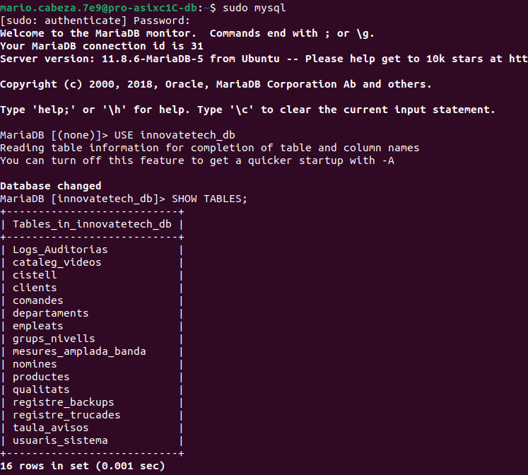

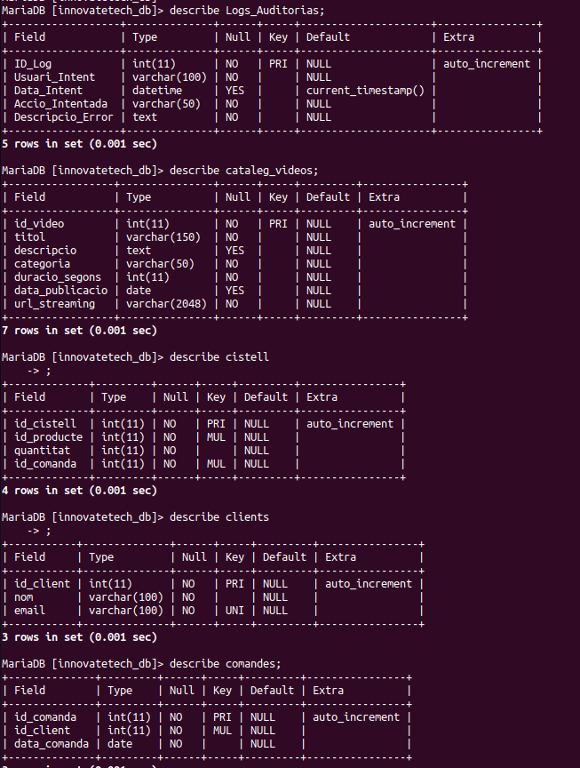

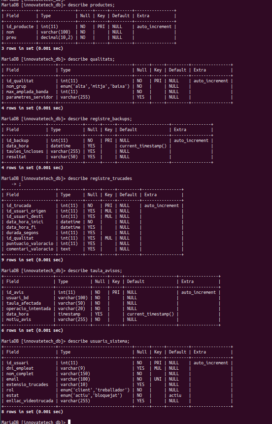

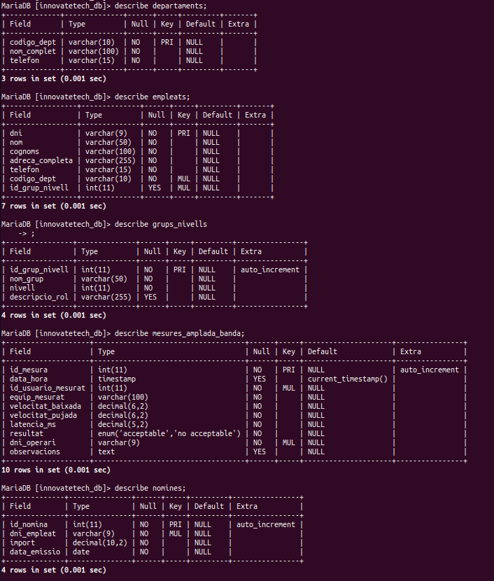